# FineWeb-2 Analytics: vie_Latn — test

> Generated: 2026-02-06 17:17:05 | Records: 28,276 | File: `/Users/apple/data/fineweb-2/vie_Latn/test`

## Table of Contents

1. [Overview](#overview)
2. [Text Statistics](#text-statistics) (Charts 1-12)
3. [Temporal Analysis](#temporal-analysis) (Charts 13-23)
4. [URL & Domain Analysis](#url--domain-analysis) (Charts 24-35)
5. [Quality & Deduplication](#quality--deduplication) (Charts 36-45)
6. [Vietnamese Content Analysis](#vietnamese-content-analysis) (Charts 46-55)

---

## Overview

### Dataset Summary

| Metric | Value |
| --- | --- |
| Total Documents | 28,276 |
| Total Characters | 120,990,529 |
| Total Words | 26,022,977 |
| Unique Domains | 17,892 |
| Date Range | 2013-12-05 to 2024-04-25 |
| Average Language Score | 0.999964 |
| Average Text Length | 4279 chars |
| Median Text Length | 3078 chars |
| Average Cluster Size | 5.7 |

---

## Text Statistics

### 1. Document Length Distribution

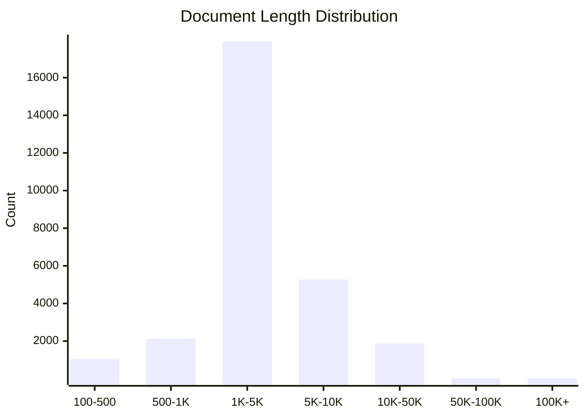
```mermaid
xychart-beta
    title "Document Length Distribution"
    x-axis ["100-500", "500-1K", "1K-5K", "5K-10K", "10K-50K", "50K-100K", "100K+"]
    y-axis "Count"
    bar [1042, 2119, 17937, 5268, 1869, 24, 17]
```

### 2. Word Count Distribution

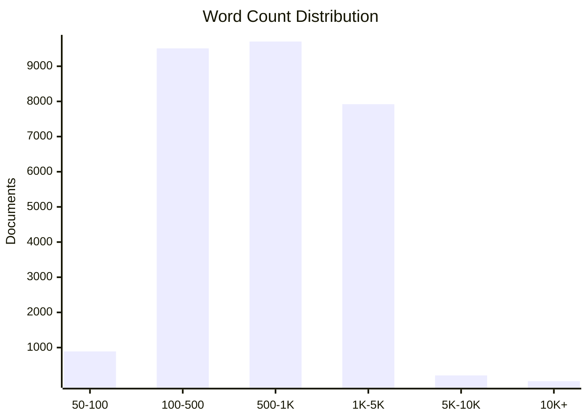
```mermaid
xychart-beta
    title "Word Count Distribution"
    x-axis ["50-100", "100-500", "500-1K", "1K-5K", "5K-10K", "10K+"]
    y-axis "Documents"
    bar [891, 9508, 9703, 7920, 209, 45]
```

### 3. Sentence Count Distribution

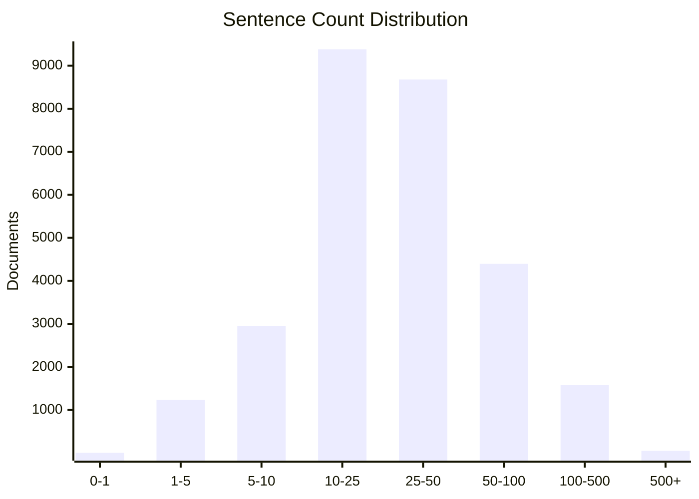
```mermaid
xychart-beta
    title "Sentence Count Distribution"
    x-axis ["0-1", "1-5", "5-10", "10-25", "25-50", "50-100", "100-500", "500+"]
    y-axis "Documents"
    bar [3, 1235, 2954, 9380, 8678, 4396, 1580, 50]
```

### 4. Line Count Distribution

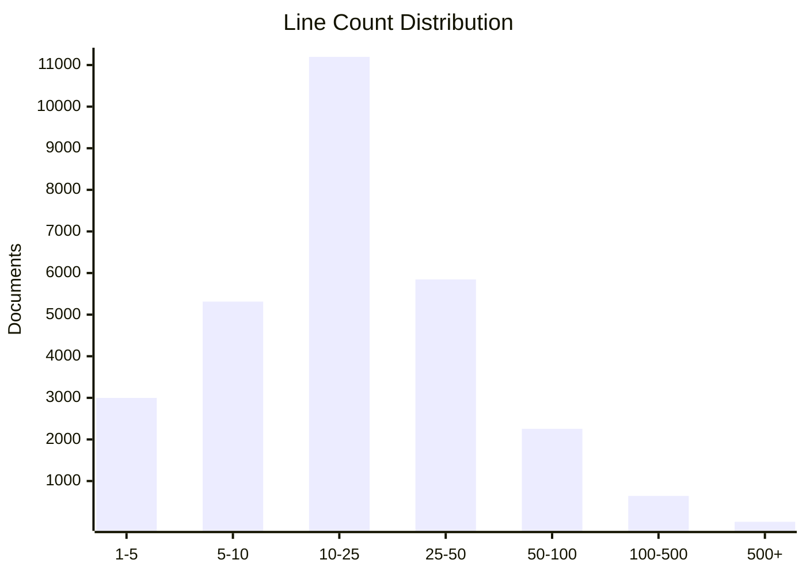
```mermaid
xychart-beta
    title "Line Count Distribution"
    x-axis ["1-5", "5-10", "10-25", "25-50", "50-100", "100-500", "500+"]
    y-axis "Documents"
    bar [2999, 5314, 11197, 5847, 2256, 643, 20]
```

### 5. Text Length Percentiles

| Percentile | Value |
| --- | --- |
| P1 | 342 |
| P5 | 591 |
| P10 | 925.5 |
| P25 | 1711 |
| P50 (Median) | 3077.5 |
| P75 | 5042 |
| P90 | 8285 |
| P95 | 11494 |
| P99 | 22320.5 |
| Mean | 4278.9125 |
| Std Dev | 6334.4551 |
| Min | 242 |
| Max | 436721 |

### 6. Short Document Analysis

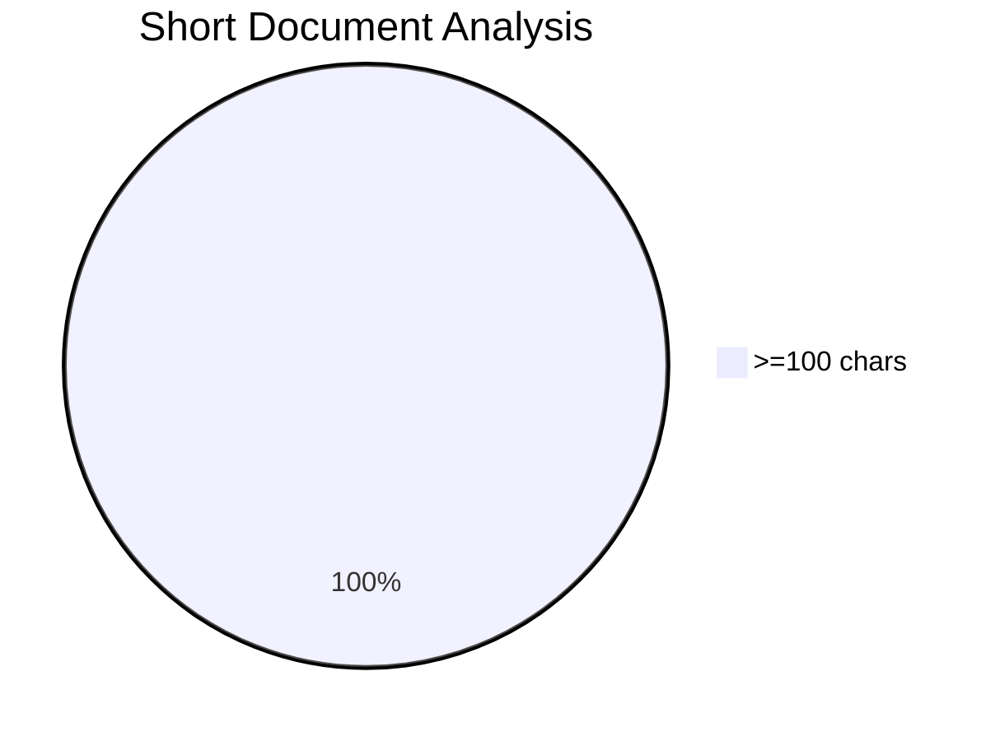
```mermaid
pie title Short Document Analysis
    ">=100 chars" : 28276.0
```

### 7. Character Type Distribution

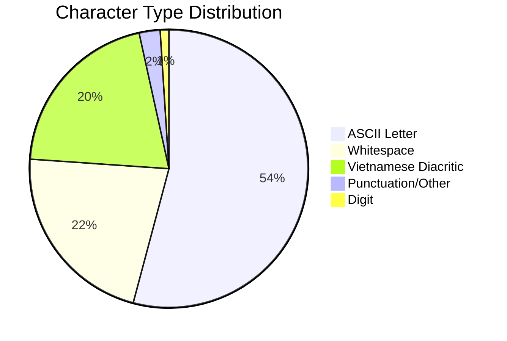
```mermaid
pie title Character Type Distribution
    "ASCII Letter" : 5192414.0
    "Whitespace" : 2105548.0
    "Vietnamese Diacritic" : 1962375.0
    "Punctuation/Other" : 233162.0
    "Digit" : 97084.0
```

### 8. Top 30 Most Frequent Words

**Top 30 Most Frequent Words**

```
và      ████████████████████████████████████████ 54.0K
của    ████████████████████████████████████ 48.1K
có      ███████████████████████████████████ 47.2K
là      ██████████████████████████████████ 46.5K
các     ██████████████████████████ 35.1K
được ██████████████████████████ 34.8K
một    ████████████████████████ 32.9K
trong    ███████████████████████ 31.7K
cho      ██████████████████████ 29.7K
với    ██████████████████████ 29.4K
không   █████████████████████ 27.8K
những  ████████████████████ 27.1K
người ██████████████████ 24.5K
đã     ████████████████ 21.1K
để    ███████████████ 20.4K
bạn    ███████████████ 20.1K
thể    ██████████████ 19.2K
công    █████████████ 17.5K
khi      ████████████ 16.8K
đến   ████████████ 16.2K
nhiều  ████████████ 16.1K
sẽ     ████████████ 15.5K
về     ███████████ 14.7K
từ     ███████████ 14.5K
tại    ██████████ 14.1K
như     ██████████ 13.9K
này     ██████████ 13.3K
trên    ██████████ 12.9K
vào     ██████████ 12.9K
làm     █████████ 12.8K
```

### 9. Top 30 Most Frequent Bigrams

**Top 30 Most Frequent Bigrams**

```
và và      ████████████████████████████████████████ 181
và là      ███████████████████████████████████ 158
có và      █████████████████████████████████ 149
là là      ████████████████████████████████ 147
của là    ████████████████████████████████ 146
và của    ████████████████████████████████ 144
là và      ███████████████████████████████ 141
là có      ███████████████████████████████ 141
của của  ███████████████████████████████ 139
của có    ████████████████████████████ 127
có là      ████████████████████████████ 127
của và    ████████████████████████████ 126
là của    ███████████████████████████ 124
và có      ███████████████████████████ 121
có của    ██████████████████████████ 117
một là    █████████████████████████ 114
và các     █████████████████████████ 114
là một    █████████████████████████ 113
một và    █████████████████████████ 112
có có      █████████████████████████ 111
các và     ████████████████████████ 110
được và ████████████████████████ 108
các của   ███████████████████████ 106
và trong    ███████████████████████ 105
được là ███████████████████████ 105
và một    ███████████████████████ 104
là các     ███████████████████████ 104
với là    ███████████████████████ 103
và được ███████████████████████ 102
có trong    ███████████████████████ 102
```


---

## Temporal Analysis

### 10. Documents per Year

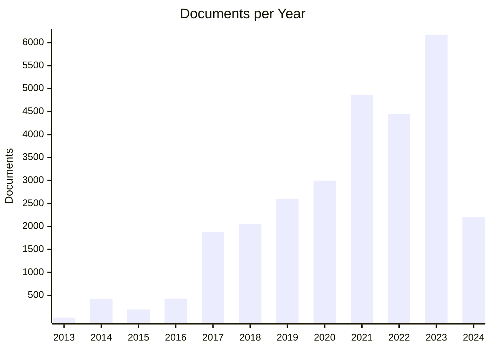
```mermaid
xychart-beta
    title "Documents per Year"
    x-axis ["2013", "2014", "2015", "2016", "2017", "2018", "2019", "2020", "2021", "2022", "2023", "2024"]
    y-axis "Documents"
    bar [16, 422, 192, 431, 1885, 2058, 2597, 2998, 4857, 4446, 6175, 2199]
```

### 11. Monthly Document Trend

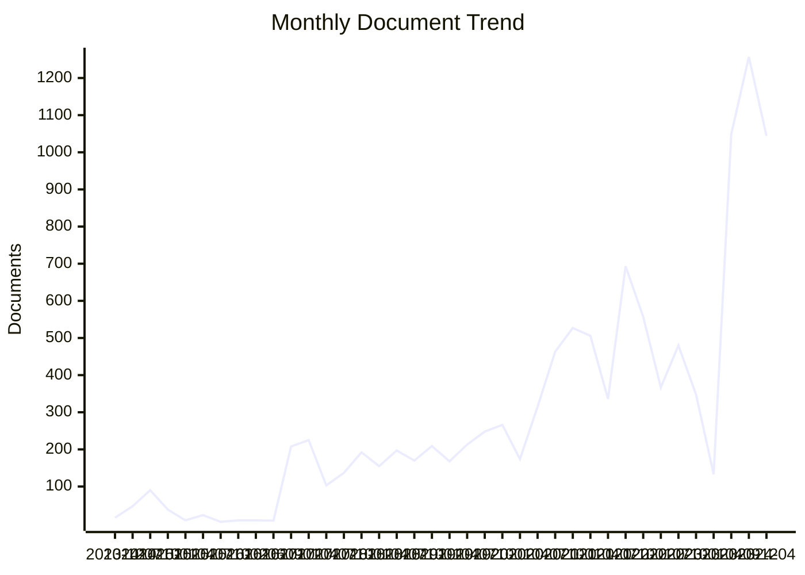
```mermaid
xychart-beta
    title "Monthly Document Trend"
    x-axis ["2013-12", "2014-07", "2014-10", "2015-01", "2015-04", "2015-07", "2015-10", "2016-02", "2016-06", "2016-09", "2017-01", "2017-04", "2017-07", "2017-10", "2018-01", "2018-04", "2018-07", "2018-10", "2019-01", "2019-04", "2019-07", "2019-10", "2020-01", "2020-04", "2020-07", "2020-10", "2021-01", "2021-04", "2021-07", "2021-10", "2022-01", "2022-07", "2022-10", "2023-01", "2023-04", "2023-09", "2023-12", "2024-04"]
    y-axis "Documents"
    line [16, 47, 90, 38, 9, 23, 5, 9, 9, 8, 208, 225, 103, 137, 192, 155, 197, 170, 209, 168, 213, 248, 266, 174, 315, 463, 527, 506, 336, 693, 557, 367, 480, 348, 133, 1049, 1257, 1044]
```

### 12. Top 30 Common Crawl Dumps

**Top 30 Common Crawl Dumps**

```
CC-MAIN-2023-50 ████████████████████████████████████████ 1.6K
CC-MAIN-2023-40 ██████████████████████████████████████ 1.5K
CC-MAIN-2024-10 █████████████████████████████ 1.2K
CC-MAIN-2023-23 ███████████████████████████ 1.1K
CC-MAIN-2023-14 ███████████████████████████ 1.1K
CC-MAIN-2024-18 ██████████████████████████ 1.0K
CC-MAIN-2022-49 ████████████████████████ 951
CC-MAIN-2023-06 ███████████████████████ 920
CC-MAIN-2022-40 ███████████████████████ 911
CC-MAIN-2022-21 ███████████████████ 761
CC-MAIN-2021-43 █████████████████ 693
CC-MAIN-2022-27 █████████████████ 679
CC-MAIN-2021-39 ████████████████ 636
CC-MAIN-2022-33 ███████████████ 587
CC-MAIN-2021-31 ██████████████ 567
CC-MAIN-2022-05 ██████████████ 557
CC-MAIN-2021-49 ██████████████ 555
CC-MAIN-2021-04 █████████████ 527
CC-MAIN-2021-25 █████████████ 522
CC-MAIN-2021-17 █████████████ 506
CC-MAIN-2020-40 ████████████ 486
CC-MAIN-2021-10 ███████████ 434
CC-MAIN-2020-45 ███████████ 427
CC-MAIN-2021-21 ██████████ 417
CC-MAIN-2020-50 ██████████ 411
CC-MAIN-2020-29 ████████ 315
CC-MAIN-2020-34 ████████ 305
CC-MAIN-2020-24 ███████ 295
CC-MAIN-2020-05 ███████ 266
CC-MAIN-2019-43 ██████ 248
```

### 13. Crawl Date Summary

| Metric | Value |
| --- | --- |
| Earliest Date | 2013-12-05T10:00:13Z |
| Latest Date | 2024-04-25T15:45:54Z |
| Unique Years | 12 |
| Unique Months | 112 |
| Unique Dumps | 95 |

### 14. Day-of-Week Distribution

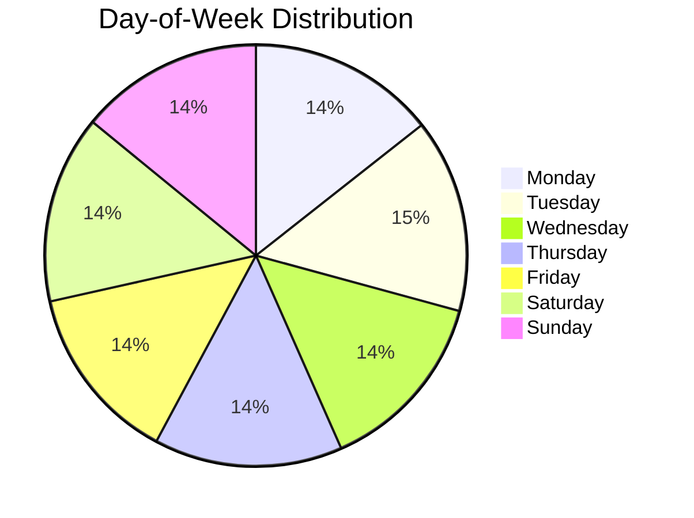
```mermaid
pie title Day-of-Week Distribution
    "Monday" : 4064.0
    "Tuesday" : 4205.0
    "Wednesday" : 3998.0
    "Thursday" : 4083.0
    "Friday" : 3868.0
    "Saturday" : 4078.0
    "Sunday" : 3980.0
```

### 15. Documents by Hour (UTC)

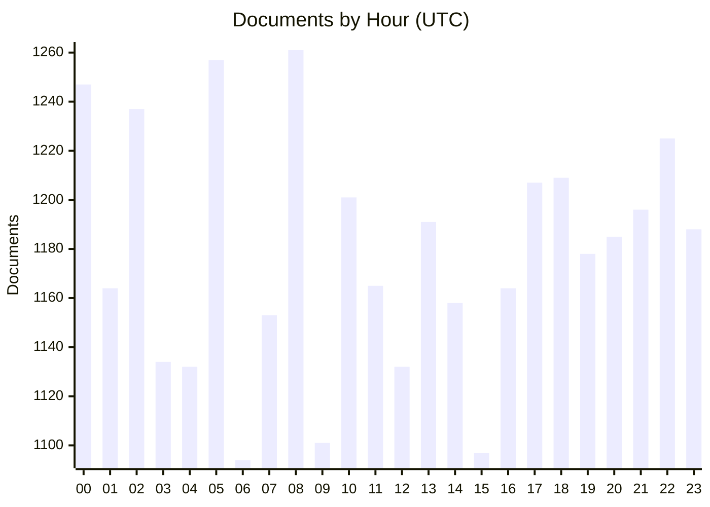
```mermaid
xychart-beta
    title "Documents by Hour (UTC)"
    x-axis ["00", "01", "02", "03", "04", "05", "06", "07", "08", "09", "10", "11", "12", "13", "14", "15", "16", "17", "18", "19", "20", "21", "22", "23"]
    y-axis "Documents"
    bar [1247, 1164, 1237, 1134, 1132, 1257, 1094, 1153, 1261, 1101, 1201, 1165, 1132, 1191, 1158, 1097, 1164, 1207, 1209, 1178, 1185, 1196, 1225, 1188]
```

### 16. Year-over-Year Growth

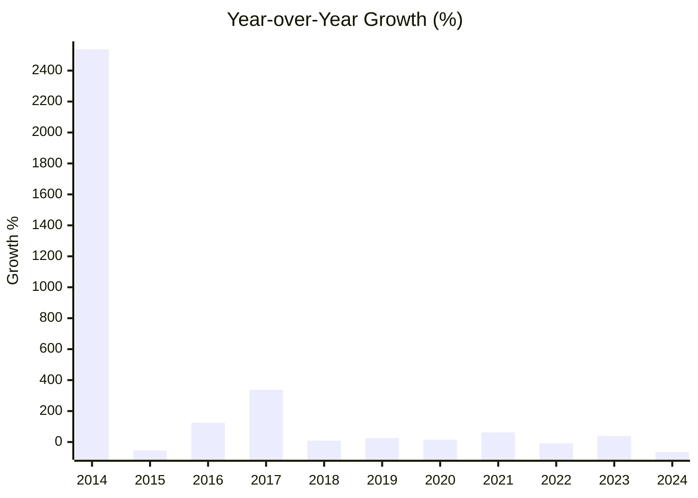
```mermaid
xychart-beta
    title "Year-over-Year Growth (%)"
    x-axis ["2014", "2015", "2016", "2017", "2018", "2019", "2020", "2021", "2022", "2023", "2024"]
    y-axis "Growth %"
    bar [2538, -55, 124, 337, 9, 26, 15, 62, -8, 39, -64]
```

### 17. Dump Timeline (Chronological)

**Dump Timeline (Chronological)**

```
CC-MAIN-2019-18 ████ 168
CC-MAIN-2019-22 █████ 213
CC-MAIN-2019-26 █████ 210
CC-MAIN-2019-30 █████ 213
CC-MAIN-2019-35 ██████ 242
CC-MAIN-2019-39 █████ 205
CC-MAIN-2019-43 ██████ 248
CC-MAIN-2019-47 ██████ 243
CC-MAIN-2019-51 ██████ 230
CC-MAIN-2020-05 ███████ 266
CC-MAIN-2020-10 ██████ 247
CC-MAIN-2020-16 ██████ 246
CC-MAIN-2020-24 ███████ 295
CC-MAIN-2020-29 ████████ 315
CC-MAIN-2020-34 ████████ 305
CC-MAIN-2020-40 ████████████ 486
CC-MAIN-2020-45 ███████████ 427
CC-MAIN-2020-50 ██████████ 411
CC-MAIN-2021-04 █████████████ 527
CC-MAIN-2021-10 ███████████ 434
CC-MAIN-2021-17 █████████████ 506
CC-MAIN-2021-21 ██████████ 417
CC-MAIN-2021-25 █████████████ 522
CC-MAIN-2021-31 ██████████████ 567
CC-MAIN-2021-39 ████████████████ 636
CC-MAIN-2021-43 █████████████████ 693
CC-MAIN-2021-49 ██████████████ 555
CC-MAIN-2022-05 ██████████████ 557
CC-MAIN-2022-21 ███████████████████ 761
CC-MAIN-2022-27 █████████████████ 679
CC-MAIN-2022-33 ███████████████ 587
CC-MAIN-2022-40 ███████████████████████ 911
CC-MAIN-2022-49 ████████████████████████ 951
CC-MAIN-2023-06 ███████████████████████ 920
CC-MAIN-2023-14 ███████████████████████████ 1.1K
CC-MAIN-2023-23 ███████████████████████████ 1.1K
CC-MAIN-2023-40 ██████████████████████████████████████ 1.5K
CC-MAIN-2023-50 ████████████████████████████████████████ 1.6K
CC-MAIN-2024-10 █████████████████████████████ 1.2K
CC-MAIN-2024-18 ██████████████████████████ 1.0K
```

### 18. Quarterly Document Volume

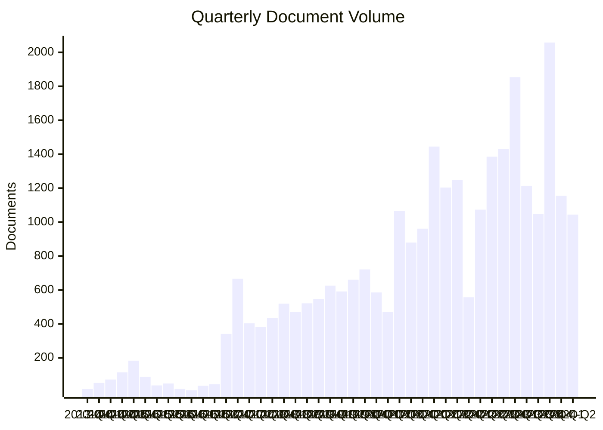
```mermaid
xychart-beta
    title "Quarterly Document Volume"
    x-axis ["2013-Q4", "2014-Q1", "2014-Q2", "2014-Q3", "2014-Q4", "2015-Q1", "2015-Q2", "2015-Q3", "2015-Q4", "2016-Q1", "2016-Q2", "2016-Q3", "2016-Q4", "2017-Q1", "2017-Q2", "2017-Q3", "2017-Q4", "2018-Q1", "2018-Q2", "2018-Q3", "2018-Q4", "2019-Q1", "2019-Q2", "2019-Q3", "2019-Q4", "2020-Q1", "2020-Q2", "2020-Q3", "2020-Q4", "2021-Q1", "2021-Q2", "2021-Q3", "2021-Q4", "2022-Q1", "2022-Q2", "2022-Q3", "2022-Q4", "2023-Q1", "2023-Q2", "2023-Q3", "2023-Q4", "2024-Q1", "2024-Q2"]
    y-axis "Documents"
    bar [16, 53, 72, 114, 183, 88, 37, 49, 18, 9, 36, 45, 341, 666, 403, 382, 434, 519, 471, 521, 547, 625, 591, 660, 721, 585, 469, 1065, 879, 961, 1445, 1203, 1248, 557, 1073, 1385, 1431, 1854, 1214, 1049, 2058, 1155, 1044]
```


---

## URL & Domain Analysis

### 19. Top 30 Domains

**Top 30 Domains**

```
vietbao.vn          ████████████████████████████████████████ 280
eva.vn              ███████████████ 106
thanhnien.vn        ███████████████ 103
vtc.vn              ██████████████ 99
baomoi.com          ██████████████ 96
plo.vn              ██████████████ 95
truyenfull.vn       █████████████ 91
vietbao.com         ████████████ 87
nld.com.vn          ████████████ 86
vietnamnet.vn       ███████████ 75
voatiengviet.com    ███████████ 75
laodong.vn          ███████████ 74
tienphong.vn        ██████████ 73
saostar.vn          ██████████ 73
doisongphapluat.com ██████████ 71
m.phim.in.net       ██████████ 70
sggp.org.vn         ██████████ 68
vov.vn              ██████████ 67
kenh14.vn           █████████ 61
danviet.vn          ████████ 59
vtv.vn              ████████ 59
nhaccuatui.com      ████████ 57
dantri.com.vn       ████████ 54
bongda24h.vn        ████████ 53
anninhthudo.vn      ███████ 47
cand.com.vn         ███████ 47
phunuvagiadinh.vn   ██████ 45
voh.com.vn          ██████ 44
yan.vn              ██████ 44
suckhoedoisong.vn   ██████ 43
```

### 20. TLD Distribution

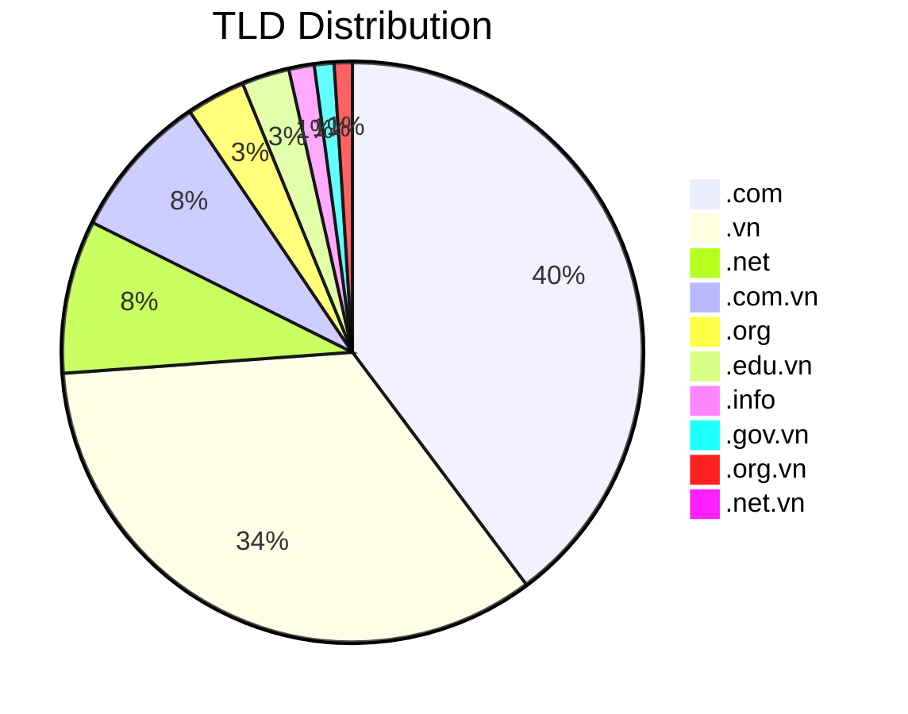
```mermaid
pie title TLD Distribution
    ".com" : 10461.0
    ".vn" : 8959.0
    ".net" : 2243.0
    ".com.vn" : 2149.0
    ".org" : 864.0
    ".edu.vn" : 697.0
    ".info" : 372.0
    ".gov.vn" : 288.0
    ".org.vn" : 266.0
    ".net.vn" : 162.0
```

### 21. Domain Diversity Over Time

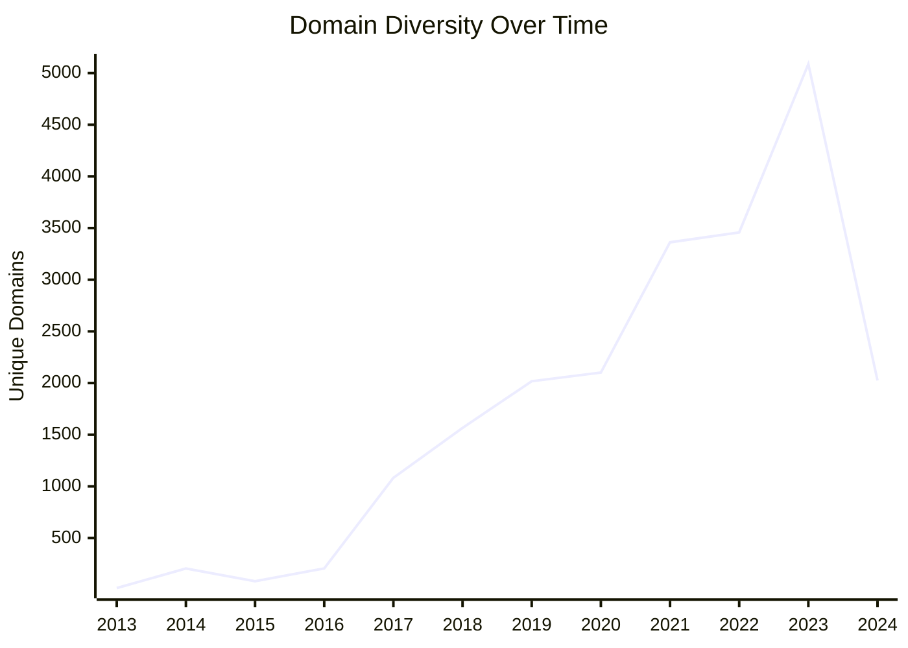
```mermaid
xychart-beta
    title "Domain Diversity Over Time"
    x-axis ["2013", "2014", "2015", "2016", "2017", "2018", "2019", "2020", "2021", "2022", "2023", "2024"]
    y-axis "Unique Domains"
    line [16, 205, 82, 206, 1083, 1566, 2017, 2102, 3362, 3458, 5087, 2025]
```

### 22. URL Path Depth

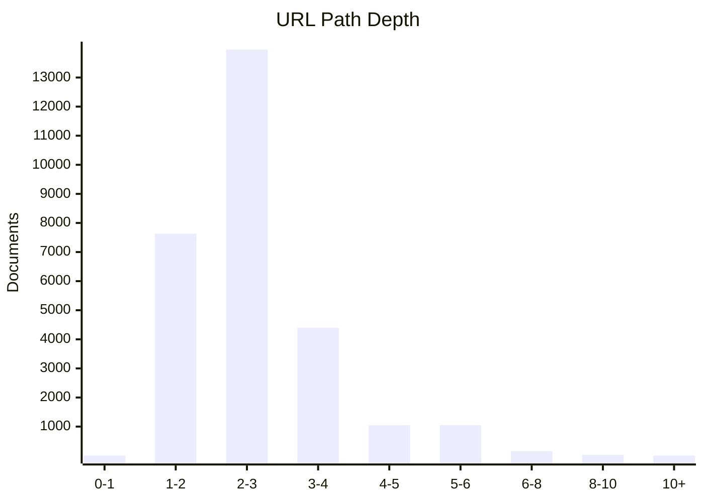
```mermaid
xychart-beta
    title "URL Path Depth"
    x-axis ["0-1", "1-2", "2-3", "3-4", "4-5", "5-6", "6-8", "8-10", "10+"]
    y-axis "Documents"
    bar [4, 7632, 13959, 4398, 1045, 1049, 152, 32, 5]
```

### 23. Protocol Distribution

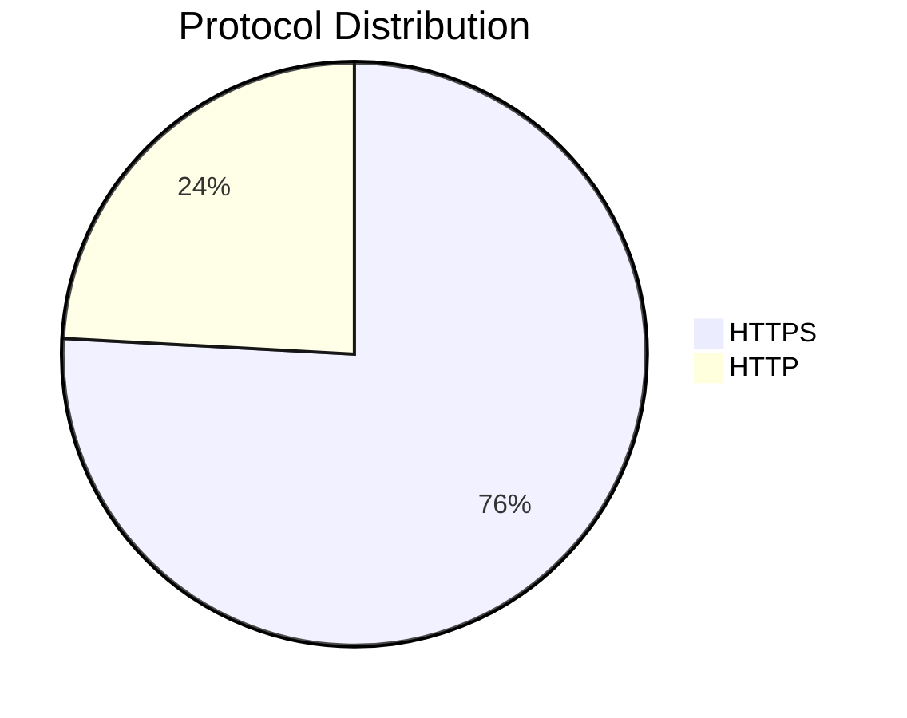
```mermaid
pie title Protocol Distribution
    "HTTPS" : 21448.0
    "HTTP" : 6828.0
```

### 24. URL Length Distribution

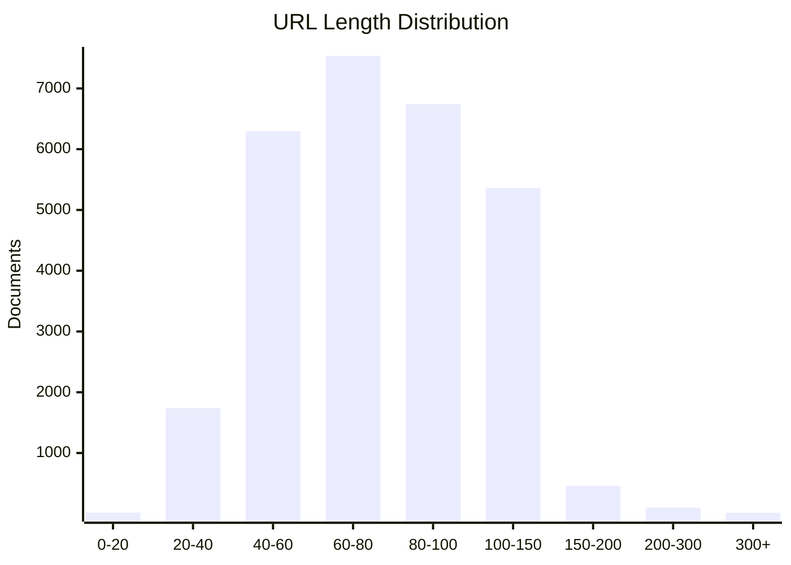
```mermaid
xychart-beta
    title "URL Length Distribution"
    x-axis ["0-20", "20-40", "40-60", "60-80", "80-100", "100-150", "150-200", "200-300", "300+"]
    y-axis "Documents"
    bar [19, 1740, 6296, 7536, 6743, 5363, 461, 101, 17]
```

### 25. Subdomain Analysis

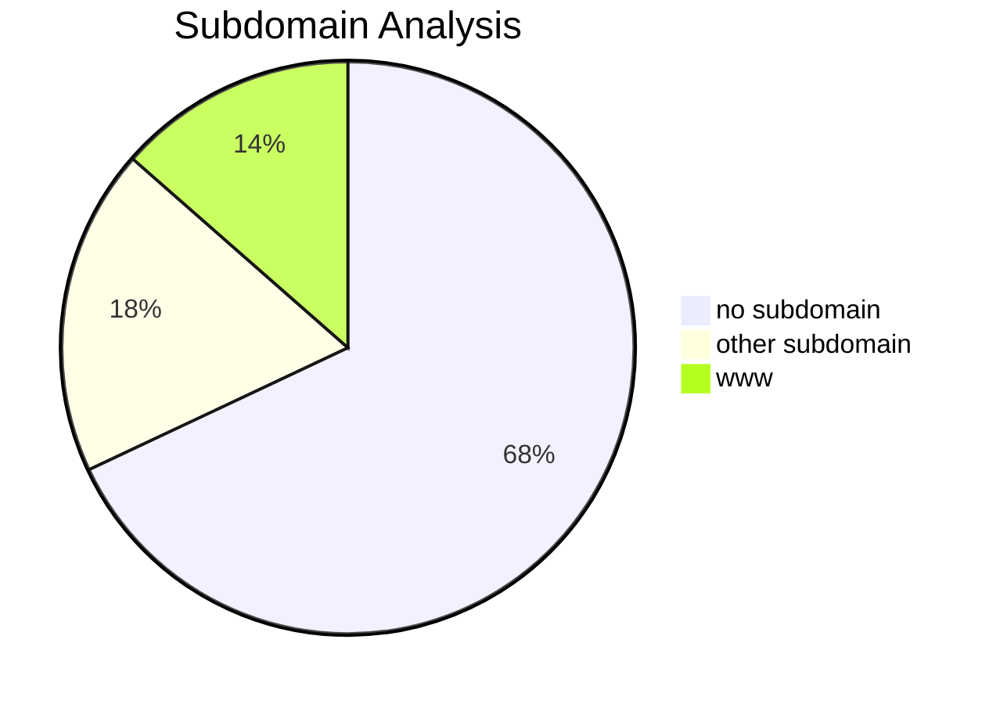
```mermaid
pie title Subdomain Analysis
    "no subdomain" : 19227.0
    "other subdomain" : 5223.0
    "www" : 3826.0
```

### 26. Top 20 Vietnamese Domains (.vn)

**Top 20 Vietnamese Domains (.vn)**

```
vietbao.vn     ████████████████████████████████████████ 280
eva.vn         ███████████████ 106
thanhnien.vn   ███████████████ 103
vtc.vn         ██████████████ 99
plo.vn         ██████████████ 95
truyenfull.vn  █████████████ 91
nld.com.vn     ████████████ 86
vietnamnet.vn  ███████████ 75
laodong.vn     ███████████ 74
tienphong.vn   ██████████ 73
saostar.vn     ██████████ 73
sggp.org.vn    ██████████ 68
vov.vn         ██████████ 67
kenh14.vn      █████████ 61
vtv.vn         ████████ 59
danviet.vn     ████████ 59
dantri.com.vn  ████████ 54
bongda24h.vn   ████████ 53
cand.com.vn    ███████ 47
anninhthudo.vn ███████ 47
```

### 27. Domain Concentration

- Total unique domains: **17892**
- Top 10 domains cover: **4.0%** of all documents
- Top 100 domains cover: **14.4%** of all documents

### 28. Top Domains by Average Text Length

**Top Domains by Average Text Length**

```
truyenfull.vn       ████████████████████████████████████████ 9.1K
vietbao.vn          ██████████████████████ 5.0K
m.phim.in.net       ██████████████████████ 5.0K
vietbao.com         ███████████████████ 4.3K
eva.vn              ██████████████ 3.2K
bongda24h.vn        █████████████ 2.9K
vietnamnet.vn       ████████████ 2.9K
danviet.vn          ████████████ 2.8K
vtc.vn              ████████████ 2.8K
dantri.com.vn       ████████████ 2.8K
sggp.org.vn         ████████████ 2.7K
vov.vn              ████████████ 2.7K
laodong.vn          ████████████ 2.7K
tienphong.vn        ███████████ 2.6K
nld.com.vn          ███████████ 2.5K
kenh14.vn           ██████████ 2.3K
baomoi.com          ██████████ 2.3K
plo.vn              ██████████ 2.2K
doisongphapluat.com ██████████ 2.2K
thanhnien.vn        █████████ 2.1K
```

### 29. New Domains per Year

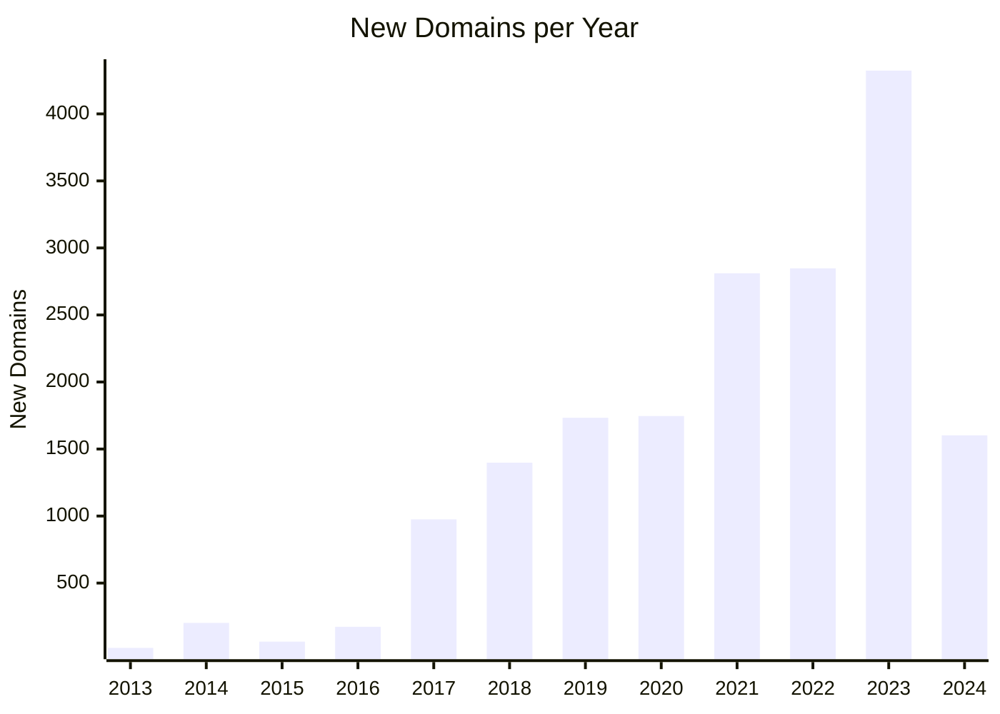
```mermaid
xychart-beta
    title "New Domains per Year"
    x-axis ["2013", "2014", "2015", "2016", "2017", "2018", "2019", "2020", "2021", "2022", "2023", "2024"]
    y-axis "New Domains"
    bar [16, 203, 63, 174, 975, 1398, 1733, 1746, 2811, 2848, 4323, 1602]
```

### 30. Query Parameter Prevalence

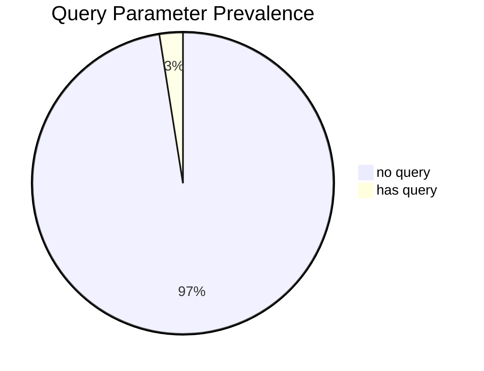
```mermaid
pie title Query Parameter Prevalence
    "no query" : 27566.0
    "has query" : 710.0
```


---

## Quality & Deduplication

### 31. Language Score Distribution

```mermaid
xychart-beta
    title "Language Score Distribution"
    x-axis ["0.8-0.9", "0.9-0.95", "0.95-0.99", "0.99-1", "1-1", "1+"]
    y-axis "Documents"
    bar [3, 7, 11, 37, 261, 27957]
```

### 32. Language Score Percentiles

| Percentile | Value |
| --- | --- |
| P1 | 1 |
| P5 | 1 |
| P10 | 1 |
| P25 | 1 |
| P50 (Median) | 1 |
| P75 | 1 |
| P90 | 1 |
| P95 | 1 |
| P99 | 1 |
| Mean | 1 |
| Std Dev | 0.0018 |
| Min | 0.8654013872146606 |
| Max | 1.0000100135803223 |

### 33. MinHash Cluster Size Distribution

```mermaid
xychart-beta
    title "MinHash Cluster Size Distribution"
    x-axis ["1-2", "2-5", "5-10", "10-20", "20-50", "50-100", "100-500", "500+"]
    y-axis "Documents"
    bar [10714, 9197, 4741, 2531, 945, 103, 42, 3]
```

### 34. Cluster Size Categories

```mermaid
pie title Cluster Size Categories
    "Small (2-5)" : 10715.0
    "Unique (1)" : 10714.0
    "Medium (6-20)" : 5864.0
    "Large (21-100)" : 938.0
    "Very Large (100+)" : 45.0
```

### 35. Language Score vs Text Length

| Score Band | Documents | Mean Text Len | Median Text Len |
| --- | --- | --- | --- |
| 0.9-0.95 | 0 | 6990 | 3003 |
| 0.95-0.99 | 0 | 3409 | 2819 |
| <0.9 | 0 | 2914 | 2695 |
| >=0.99 | 0 | 4279 | 3078 |

### 36. Score & Cluster Summary

| Metric | Language Score | Cluster Size |
| --- | --- | --- |
| Mean | 0.999964 | 5.7 |
| Std Dev | 0.001817 | 112.2 |
| Median | 1.00001 | 2 |

### 37. Quality Score Bands

```mermaid
pie title Quality Score Bands
    "0.80-0.90" : 3.0
    "0.90-0.95" : 7.0
    "0.95-0.99" : 11.0
    "0.99-1.00" : 28255.0
```

### 38. top_langs Field Completeness

```mermaid
pie title top_langs Field Completeness
    "populated" : 28276.0
```

### 39. Avg Cluster Size by Top Dumps

**Avg Cluster Size by Top Dumps**

```
CC-MAIN-2023-50  0
CC-MAIN-2023-40  0
CC-MAIN-2024-10  0
CC-MAIN-2023-23  0
CC-MAIN-2023-14  0
CC-MAIN-2024-18  0
CC-MAIN-2022-49  0
CC-MAIN-2023-06  0
CC-MAIN-2022-40  0
CC-MAIN-2022-21  0
CC-MAIN-2021-43  0
CC-MAIN-2022-27  0
CC-MAIN-2021-39  0
CC-MAIN-2022-33  0
CC-MAIN-2021-31  0
CC-MAIN-2022-05  0
CC-MAIN-2021-49  0
CC-MAIN-2021-04  0
CC-MAIN-2021-25  0
CC-MAIN-2021-17  0
```


---

## Vietnamese Content Analysis

### 40. Vietnamese Tone Distribution

```mermaid
pie title Vietnamese Tone Distribution
    "sắc (rising)" : 1662421.0
    "huyền (falling)" : 1323308.0
    "nặng (heavy)" : 1294669.0
    "hỏi (questioning)" : 752966.0
    "ngã (tumbling)" : 340572.0
```

### 41. Vietnamese Diacritic Frequency

**Vietnamese Diacritic Frequency**

```
à  ████████████████████████████████████████ 558.4K
á  ███████████████████████████ 373.2K
ạ █████████████████ 236.3K
ế █████████████████ 233.5K
ệ ███████████████ 205.0K
ả ██████████████ 197.6K
ó  ██████████████ 193.7K
ộ █████████████ 179.3K
ấ ████████████ 170.7K
ớ ████████████ 165.4K
ố ███████████ 151.1K
ể ██████████ 142.1K
ờ ██████████ 140.1K
ợ ██████████ 138.0K
ề ██████████ 135.5K
ì  █████████ 127.7K
ủ █████████ 124.8K
ậ ████████ 108.6K
ị ████████ 106.3K
ầ ███████ 104.2K
í  ███████ 95.9K
ự ███████ 94.0K
ữ ██████ 84.7K
ụ ██████ 78.7K
ú  █████ 76.3K
ọ █████ 75.4K
ứ █████ 74.3K
ắ █████ 70.7K
ở █████ 68.5K
ã  █████ 68.1K
```

### 42. Vietnamese Vowel Frequency

**Vietnamese Vowel Frequency**

```
a  ████████████████████████████████████████ 2.3M
i  ██████████████████████████████████ 1.9M
u  ███████████████████ 1.1M
o  █████████████████ 987.9K
ê ████████████████ 927.5K
ư █████████████ 744.0K
ô ████████████ 673.1K
ơ ███████████ 641.8K
â ██████████ 580.7K
y  ████████ 432.8K
e  ██████ 364.1K
ă ████ 243.8K
```

### 43. Vietnamese Character Density

```mermaid
pie title Vietnamese Character Density
    "Vietnamese-heavy (>10%)" : 28141.0
    "Some Vietnamese (1-10%)" : 118.0
    "Minimal Vietnamese (<1%)" : 17.0
```

### 44. Vietnamese Stop Words

**Vietnamese Stop Words**

```
và      ████████████████████████████████████████ 54.0K
của    ███████████████████████████████████ 47.6K
có      ███████████████████████████████████ 47.2K
là      ██████████████████████████████████ 46.2K
các     ██████████████████████████ 35.2K
được ██████████████████████████ 34.9K
một    ████████████████████████ 33.0K
trong    ███████████████████████ 31.7K
cho      ██████████████████████ 29.8K
với    ██████████████████████ 29.4K
không   █████████████████████ 27.8K
những  ████████████████████ 27.2K
người ██████████████████ 24.5K
đã     ████████████████ 21.1K
để    ███████████████ 20.4K
khi      ████████████ 16.9K
nhiều  ████████████ 16.3K
đến   ████████████ 16.2K
sẽ     ████████████ 15.6K
về     ███████████ 14.9K
từ     ███████████ 14.3K
tại    ██████████ 14.0K
như     ██████████ 13.9K
này     ██████████ 13.2K
trên    ██████████ 12.9K
vào     ██████████ 12.8K
ra       █████████ 12.4K
cũng    █████████ 12.1K
bị     ████████ 10.9K
mà      ███████ 9.6K
```

### 45. Sentence-Ending Punctuation

```mermaid
pie title Sentence-Ending Punctuation
    "Period (.)" : 504611.0
    "Question (?)" : 23619.0
    "Exclamation (!)" : 11933.0
```

### 46. Numeric Content Density

```mermaid
pie title Numeric Content Density
    "<1%" : 17520.0
    "1-2%" : 7469.0
    "2-5%" : 3205.0
    "5-10%" : 82.0
```

### 47. Content Cleanliness

```mermaid
pie title Content Cleanliness
    "Clean text" : 28268.0
    "Contains JS/Code" : 8.0
```

### 48. Content Type Classification

```mermaid
pie title Content Type Classification
    "Other" : 21409.0
    "News" : 3936.0
    "E-commerce" : 955.0
    "Blog" : 674.0
    "Education" : 572.0
    "Forum" : 466.0
    "Government" : 175.0
    "Wiki/Reference" : 89.0
```

### 49. Vietnamese Complexity by Dump

| Dump | Avg Diacritic Ratio | Documents |
| --- | --- | --- |
| CC-MAIN-2023-50 | 0.2043 | 1598 |
| CC-MAIN-2023-40 | 0.2065 | 1509 |
| CC-MAIN-2024-10 | 0.2062 | 1155 |
| CC-MAIN-2023-23 | 0.2048 | 1081 |
| CC-MAIN-2023-14 | 0.2051 | 1067 |
| CC-MAIN-2024-18 | 0.208 | 1044 |
| CC-MAIN-2022-49 | 0.2038 | 951 |
| CC-MAIN-2023-06 | 0.206 | 920 |
| CC-MAIN-2022-40 | 0.2051 | 911 |
| CC-MAIN-2022-21 | 0.2027 | 761 |
| CC-MAIN-2021-43 | 0.2047 | 693 |
| CC-MAIN-2022-27 | 0.2053 | 679 |
| CC-MAIN-2021-39 | 0.2046 | 636 |
| CC-MAIN-2022-33 | 0.2059 | 587 |
| CC-MAIN-2021-31 | 0.204 | 567 |
| CC-MAIN-2022-05 | 0.2045 | 557 |
| CC-MAIN-2021-49 | 0.2032 | 555 |
| CC-MAIN-2021-04 | 0.2048 | 527 |
| CC-MAIN-2021-25 | 0.2039 | 522 |
| CC-MAIN-2021-17 | 0.2042 | 506 |

---

*Report generated in 32.575s using DuckDB analytics*
