# FineWeb-2 Analytics: vie_Latn — train

> Generated: 2026-02-06 17:22:50 | Records: 2,319,000 | File: `/Users/apple/data/fineweb-2/vie_Latn/train`

## Table of Contents

1. [Overview](#overview)
2. [Text Statistics](#text-statistics) (Charts 1-12)
3. [Temporal Analysis](#temporal-analysis) (Charts 13-23)
4. [URL & Domain Analysis](#url--domain-analysis) (Charts 24-35)
5. [Quality & Deduplication](#quality--deduplication) (Charts 36-45)
6. [Vietnamese Content Analysis](#vietnamese-content-analysis) (Charts 46-55)

---

## Overview

### Dataset Summary

| Metric | Value |
| --- | --- |
| Total Documents | 2,319,000 |
| Total Characters | 9,682,333,402 |
| Total Words | 2,086,323,547 |
| Unique Domains | 277,361 |
| Date Range | 2013-05-18 to 2024-04-25 |
| Average Language Score | 0.999968 |
| Average Text Length | 4175 chars |
| Median Text Length | 3022 chars |
| Average Cluster Size | 20.9 |

---

## Text Statistics

### 1. Document Length Distribution

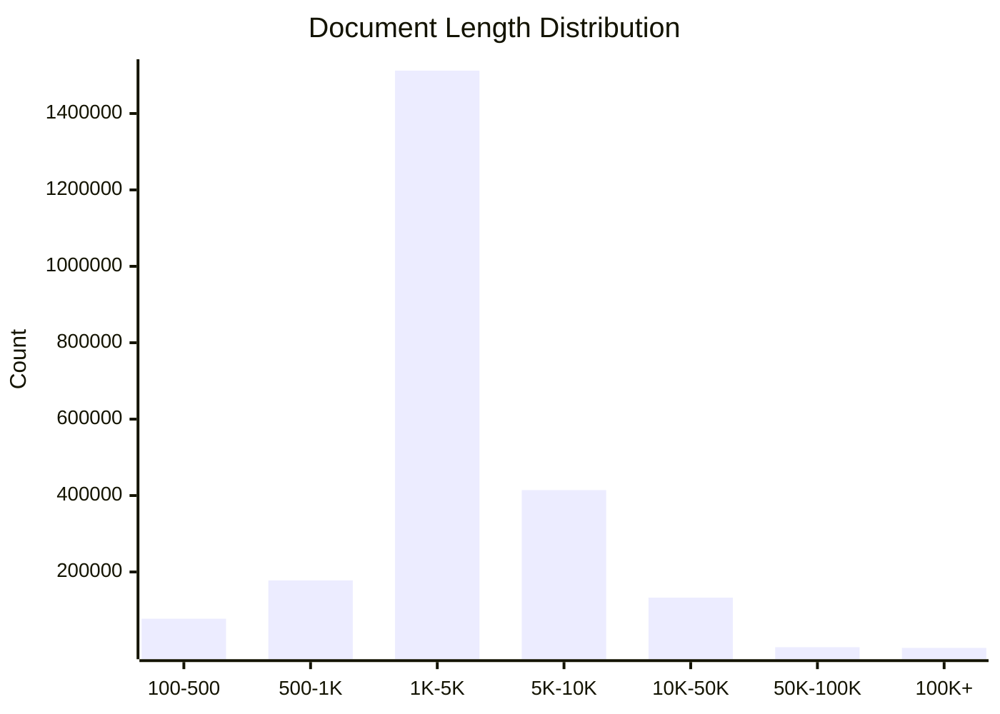
```mermaid
xychart-beta
    title "Document Length Distribution"
    x-axis ["100-500", "500-1K", "1K-5K", "5K-10K", "10K-50K", "50K-100K", "100K+"]
    y-axis "Count"
    bar [77627, 177946, 1512350, 414194, 132839, 2972, 1072]
```

### 2. Word Count Distribution

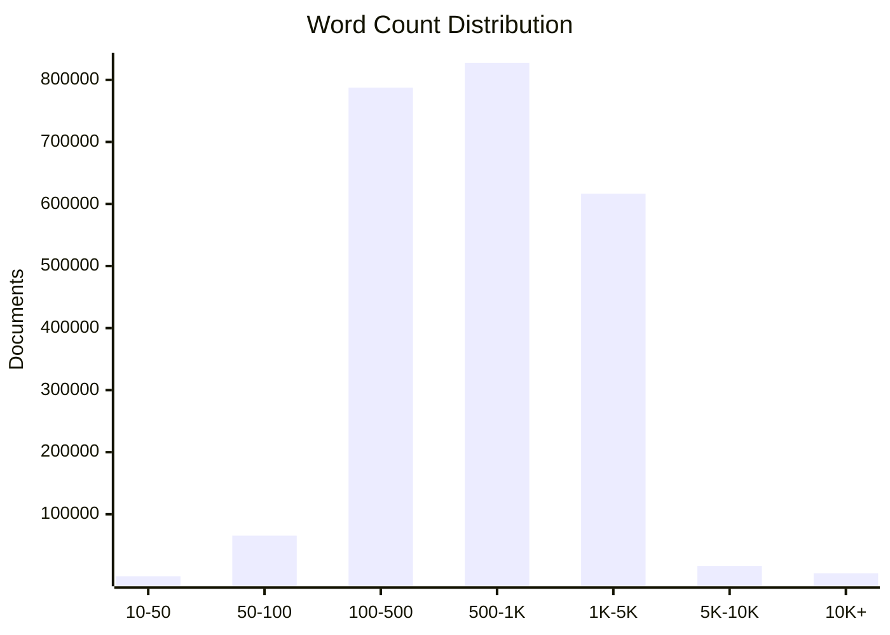
```mermaid
xychart-beta
    title "Word Count Distribution"
    x-axis ["10-50", "50-100", "100-500", "500-1K", "1K-5K", "5K-10K", "10K+"]
    y-axis "Documents"
    bar [21, 65496, 787585, 827572, 616758, 16725, 4843]
```

### 3. Sentence Count Distribution

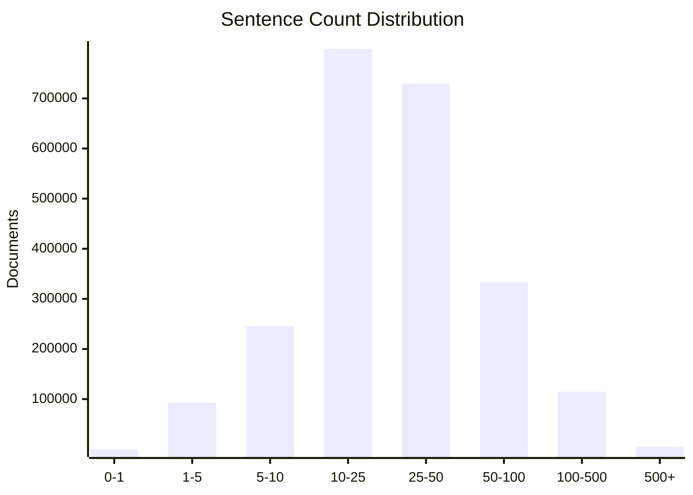
```mermaid
xychart-beta
    title "Sentence Count Distribution"
    x-axis ["0-1", "1-5", "5-10", "10-25", "25-50", "50-100", "100-500", "500+"]
    y-axis "Documents"
    bar [50, 93217, 245234, 798697, 729455, 332965, 114716, 4666]
```

### 4. Line Count Distribution

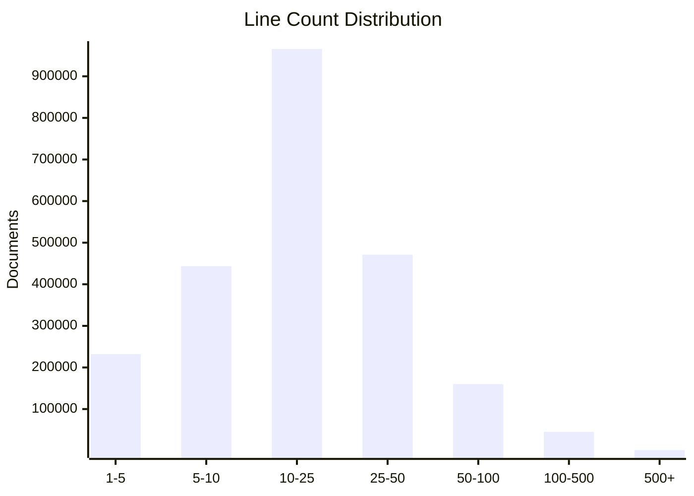
```mermaid
xychart-beta
    title "Line Count Distribution"
    x-axis ["1-5", "5-10", "10-25", "25-50", "50-100", "100-500", "500+"]
    y-axis "Documents"
    bar [232015, 443691, 965557, 471143, 160096, 45210, 1288]
```

### 5. Text Length Percentiles

| Percentile | Value |
| --- | --- |
| P1 | 346 |
| P5 | 608 |
| P10 | 937 |
| P25 | 1731 |
| P50 (Median) | 3022 |
| P75 | 4870 |
| P90 | 7759 |
| P95 | 10788 |
| P99 | 22363 |
| Mean | 4175.2192 |
| Std Dev | 6552.9498 |
| Min | 207 |
| Max | 564302 |

### 6. Short Document Analysis

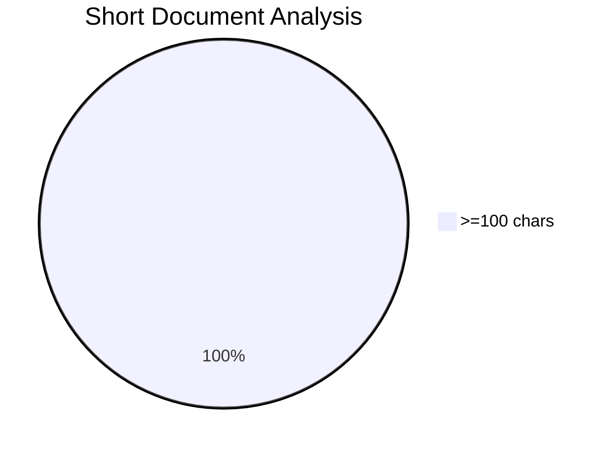
```mermaid
pie title Short Document Analysis
    ">=100 chars" : 2319000.0
```

### 7. Character Type Distribution

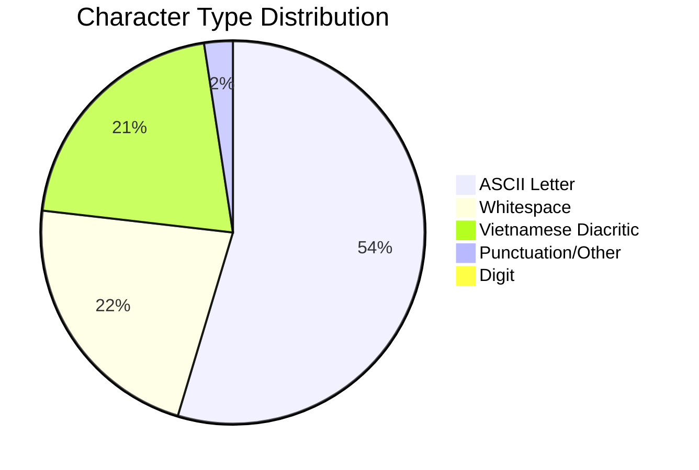
```mermaid
pie title Character Type Distribution
    "ASCII Letter" : 5209615.0
    "Whitespace" : 2115642.0
    "Vietnamese Diacritic" : 1979253.0
    "Punctuation/Other" : 230070.0
    "Digit" : 89595.0
```

### 8. Top 30 Most Frequent Words

**Top 30 Most Frequent Words**

```
và      ████████████████████████████████████████ 54.6K
của    ███████████████████████████████████ 48.3K
có      ███████████████████████████████████ 48.2K
là      ███████████████████████████████████ 48.0K
các     ███████████████████████████ 36.2K
được █████████████████████████ 34.8K
một    ████████████████████████ 33.2K
trong    ████████████████████████ 32.2K
cho      ██████████████████████ 30.5K
với    ██████████████████████ 29.9K
không   █████████████████████ 28.6K
những  █████████████████████ 28.3K
người ██████████████████ 24.2K
bạn    ████████████████ 21.4K
để    ███████████████ 20.8K
đã     ███████████████ 20.7K
thể    ██████████████ 19.1K
công    ██████████████ 18.4K
khi      █████████████ 17.1K
nhiều  ████████████ 16.6K
đến   ████████████ 16.4K
sẽ     ████████████ 16.0K
từ     ███████████ 14.6K
như     ███████████ 14.4K
về     ███████████ 14.3K
tại    ██████████ 13.8K
làm     ██████████ 13.7K
này     ██████████ 13.0K
trên    ██████████ 13.0K
hiện   █████████ 12.8K
```

### 9. Top 30 Most Frequent Bigrams

**Top 30 Most Frequent Bigrams**

```
và và      ████████████████████████████████████████ 179
có và      █████████████████████████████████████ 164
là của    ████████████████████████████████████ 160
và có      ████████████████████████████████████ 160
là là      ███████████████████████████████████ 158
và của    ██████████████████████████████████ 154
của của  ██████████████████████████████████ 153
là và      █████████████████████████████████ 148
và là      ████████████████████████████████ 144
có là      ████████████████████████████████ 142
của và    ███████████████████████████████ 138
là có      ██████████████████████████████ 134
có có      ██████████████████████████████ 134
của là    ██████████████████████████████ 134
có các     █████████████████████████████ 131
được và ████████████████████████████ 127
một và    ████████████████████████████ 125
của có    ███████████████████████████ 123
và một    ███████████████████████████ 123
của các   ███████████████████████████ 120
được là ███████████████████████████ 120
và với    ███████████████████████████ 120
những và  ██████████████████████████ 118
có của    ██████████████████████████ 118
và các     ██████████████████████████ 116
trong là    █████████████████████████ 114
trong và    █████████████████████████ 114
các của   █████████████████████████ 113
có được █████████████████████████ 111
các có     ████████████████████████ 108
```


---

## Temporal Analysis

### 10. Documents per Year

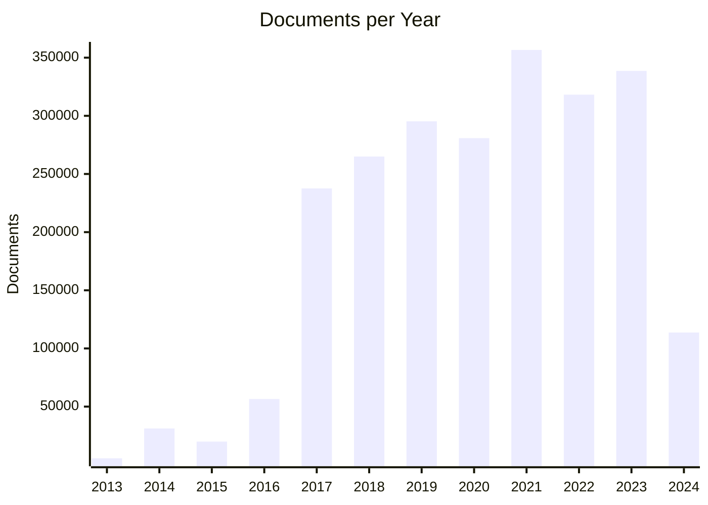
```mermaid
xychart-beta
    title "Documents per Year"
    x-axis ["2013", "2014", "2015", "2016", "2017", "2018", "2019", "2020", "2021", "2022", "2023", "2024"]
    y-axis "Documents"
    bar [5566, 31198, 19930, 56530, 237561, 265030, 295266, 280792, 356654, 318197, 338604, 113672]
```

### 11. Monthly Document Trend

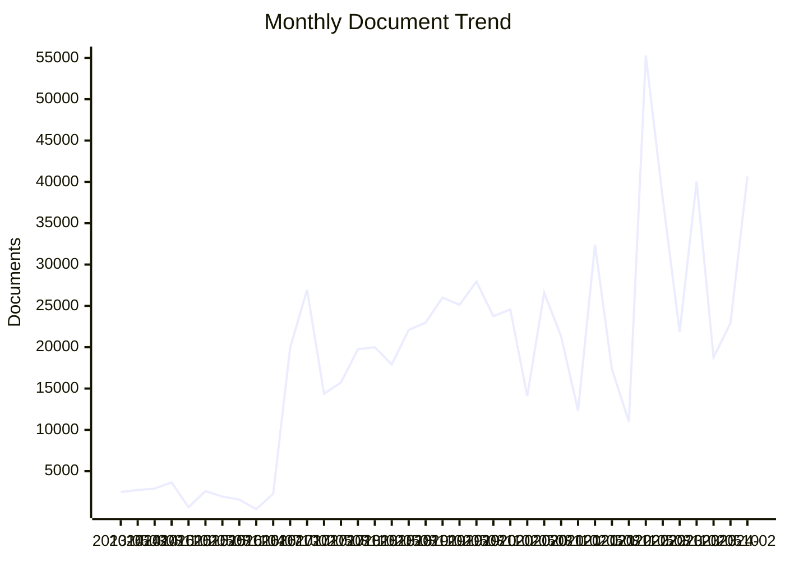
```mermaid
xychart-beta
    title "Monthly Document Trend"
    x-axis ["2013-05", "2014-03", "2014-08", "2014-11", "2015-02", "2015-05", "2015-08", "2015-11", "2016-04", "2016-07", "2016-10", "2017-02", "2017-05", "2017-08", "2017-11", "2018-02", "2018-05", "2018-08", "2018-11", "2019-02", "2019-05", "2019-08", "2019-11", "2020-02", "2020-05", "2020-08", "2020-11", "2021-02", "2021-05", "2021-08", "2021-11", "2022-05", "2022-08", "2022-11", "2023-02", "2023-05", "2023-10", "2024-02"]
    y-axis "Documents"
    line [2483, 2722, 2901, 3644, 631, 2582, 1936, 1562, 414, 2274, 19932, 26952, 14381, 15733, 19750, 19996, 17908, 22081, 22972, 26008, 25123, 27944, 23747, 24561, 14088, 26593, 21312, 12325, 32408, 17336, 11001, 55294, 38032, 21834, 40045, 18767, 22939, 40669]
```

### 12. Top 30 Common Crawl Dumps

**Top 30 Common Crawl Dumps**

```
CC-MAIN-2023-40 ████████████████████████████████████████ 78.3K
CC-MAIN-2023-50 █████████████████████████████████████ 71.8K
CC-MAIN-2022-49 ██████████████████████████████████ 66.9K
CC-MAIN-2022-40 ██████████████████████████████████ 66.0K
CC-MAIN-2023-06 █████████████████████████████████ 63.9K
CC-MAIN-2023-23 █████████████████████████████████ 63.9K
CC-MAIN-2023-14 ███████████████████████████████ 60.7K
CC-MAIN-2024-10 ███████████████████████████████ 60.2K
CC-MAIN-2022-21 ████████████████████████████ 55.3K
CC-MAIN-2024-18 ███████████████████████████ 53.5K
CC-MAIN-2022-27 █████████████████████████ 48.9K
CC-MAIN-2021-43 ████████████████████████ 48.0K
CC-MAIN-2021-31 ████████████████████████ 47.3K
CC-MAIN-2020-40 ███████████████████████ 44.8K
CC-MAIN-2022-05 ██████████████████████ 43.1K
CC-MAIN-2021-39 ██████████████████████ 42.7K
CC-MAIN-2021-17 ██████████████████████ 42.3K
CC-MAIN-2021-04 ██████████████████████ 42.1K
CC-MAIN-2022-33 ███████████████████ 38.0K
CC-MAIN-2021-10 ██████████████████ 35.5K
CC-MAIN-2020-45 █████████████████ 34.1K
CC-MAIN-2020-50 █████████████████ 33.8K
CC-MAIN-2020-29 █████████████████ 33.7K
CC-MAIN-2021-25 █████████████████ 33.5K
CC-MAIN-2021-49 █████████████████ 33.0K
CC-MAIN-2021-21 █████████████████ 32.4K
CC-MAIN-2020-05 ███████████████ 28.6K
CC-MAIN-2017-13 ███████████████ 28.5K
CC-MAIN-2019-35 ██████████████ 27.9K
CC-MAIN-2020-16 ██████████████ 27.6K
```

### 13. Crawl Date Summary

| Metric | Value |
| --- | --- |
| Earliest Date | 2013-05-18T05:13:20Z |
| Latest Date | 2024-04-25T16:00:18Z |
| Unique Years | 12 |
| Unique Months | 114 |
| Unique Dumps | 96 |

### 14. Day-of-Week Distribution

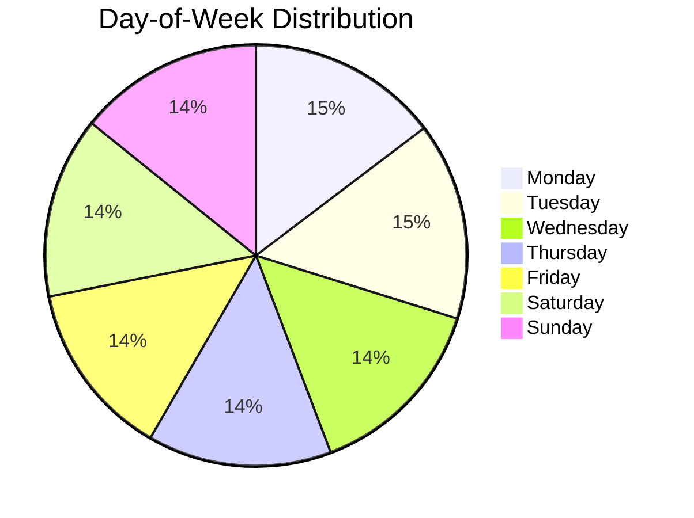
```mermaid
pie title Day-of-Week Distribution
    "Monday" : 340092.0
    "Tuesday" : 351874.0
    "Wednesday" : 333746.0
    "Thursday" : 327259.0
    "Friday" : 313821.0
    "Saturday" : 323064.0
    "Sunday" : 329144.0
```

### 15. Documents by Hour (UTC)

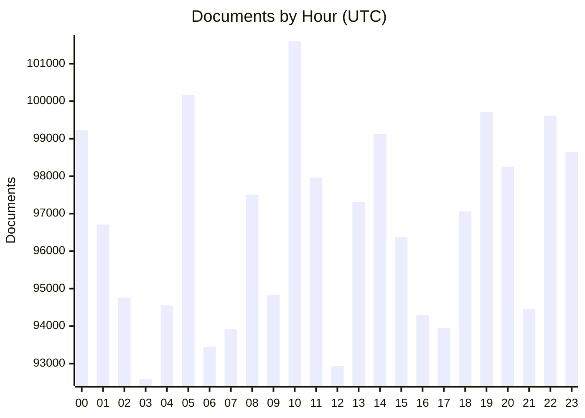
```mermaid
xychart-beta
    title "Documents by Hour (UTC)"
    x-axis ["00", "01", "02", "03", "04", "05", "06", "07", "08", "09", "10", "11", "12", "13", "14", "15", "16", "17", "18", "19", "20", "21", "22", "23"]
    y-axis "Documents"
    bar [99228, 96711, 94761, 92580, 94554, 100164, 93446, 93916, 97499, 94841, 101598, 97963, 92931, 97313, 99123, 96374, 94301, 93952, 97060, 99714, 98255, 94455, 99616, 98645]
```

### 16. Year-over-Year Growth

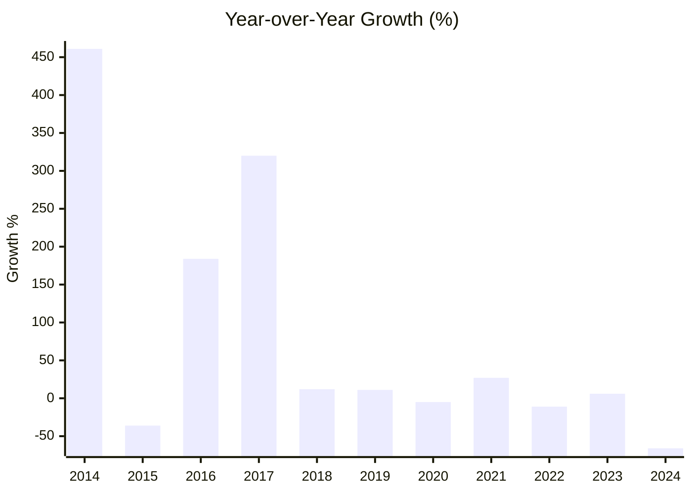
```mermaid
xychart-beta
    title "Year-over-Year Growth (%)"
    x-axis ["2014", "2015", "2016", "2017", "2018", "2019", "2020", "2021", "2022", "2023", "2024"]
    y-axis "Growth %"
    bar [461, -36, 184, 320, 12, 11, -5, 27, -11, 6, -66]
```

### 17. Dump Timeline (Chronological)

**Dump Timeline (Chronological)**

```
CC-MAIN-2019-18 ███████████ 21.5K
CC-MAIN-2019-22 █████████████ 25.1K
CC-MAIN-2019-26 ████████████ 23.7K
CC-MAIN-2019-30 ████████████ 24.2K
CC-MAIN-2019-35 ██████████████ 27.9K
CC-MAIN-2019-39 ████████████ 23.0K
CC-MAIN-2019-43 ██████████████ 26.9K
CC-MAIN-2019-47 ████████████ 23.7K
CC-MAIN-2019-51 ████████████ 23.1K
CC-MAIN-2020-05 ███████████████ 28.6K
CC-MAIN-2020-10 █████████████ 24.6K
CC-MAIN-2020-16 ██████████████ 27.6K
CC-MAIN-2020-24 ██████████████ 27.2K
CC-MAIN-2020-29 █████████████████ 33.7K
CC-MAIN-2020-34 ██████████████ 26.6K
CC-MAIN-2020-40 ███████████████████████ 44.8K
CC-MAIN-2020-45 █████████████████ 34.1K
CC-MAIN-2020-50 █████████████████ 33.8K
CC-MAIN-2021-04 ██████████████████████ 42.1K
CC-MAIN-2021-10 ██████████████████ 35.5K
CC-MAIN-2021-17 ██████████████████████ 42.3K
CC-MAIN-2021-21 █████████████████ 32.4K
CC-MAIN-2021-25 █████████████████ 33.5K
CC-MAIN-2021-31 ████████████████████████ 47.3K
CC-MAIN-2021-39 ██████████████████████ 42.7K
CC-MAIN-2021-43 ████████████████████████ 48.0K
CC-MAIN-2021-49 █████████████████ 33.0K
CC-MAIN-2022-05 ██████████████████████ 43.1K
CC-MAIN-2022-21 ████████████████████████████ 55.3K
CC-MAIN-2022-27 █████████████████████████ 48.9K
CC-MAIN-2022-33 ███████████████████ 38.0K
CC-MAIN-2022-40 ██████████████████████████████████ 66.0K
CC-MAIN-2022-49 ██████████████████████████████████ 66.9K
CC-MAIN-2023-06 █████████████████████████████████ 63.9K
CC-MAIN-2023-14 ███████████████████████████████ 60.7K
CC-MAIN-2023-23 █████████████████████████████████ 63.9K
CC-MAIN-2023-40 ████████████████████████████████████████ 78.3K
CC-MAIN-2023-50 █████████████████████████████████████ 71.8K
CC-MAIN-2024-10 ███████████████████████████████ 60.2K
CC-MAIN-2024-18 ███████████████████████████ 53.5K
```

### 18. Quarterly Document Volume

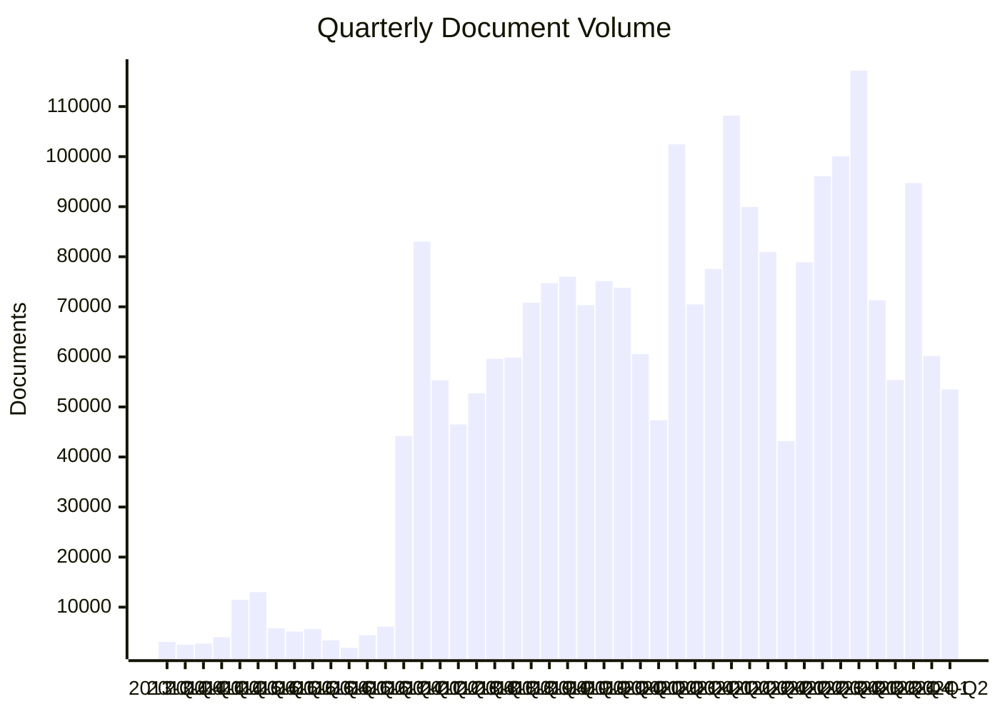
```mermaid
xychart-beta
    title "Quarterly Document Volume"
    x-axis ["2013-Q2", "2013-Q4", "2014-Q1", "2014-Q2", "2014-Q3", "2014-Q4", "2015-Q1", "2015-Q2", "2015-Q3", "2015-Q4", "2016-Q1", "2016-Q2", "2016-Q3", "2016-Q4", "2017-Q1", "2017-Q2", "2017-Q3", "2017-Q4", "2018-Q1", "2018-Q2", "2018-Q3", "2018-Q4", "2019-Q1", "2019-Q2", "2019-Q3", "2019-Q4", "2020-Q1", "2020-Q2", "2020-Q3", "2020-Q4", "2021-Q1", "2021-Q2", "2021-Q3", "2021-Q4", "2022-Q1", "2022-Q2", "2022-Q3", "2022-Q4", "2023-Q1", "2023-Q2", "2023-Q3", "2023-Q4", "2024-Q1", "2024-Q2"]
    y-axis "Documents"
    bar [3074, 2492, 2722, 4005, 11463, 13008, 5786, 5130, 5648, 3366, 1850, 4388, 6090, 44202, 83022, 55338, 46489, 52712, 59614, 59853, 70826, 74737, 76022, 70324, 75147, 73773, 60556, 47329, 102441, 70466, 77561, 108206, 89936, 80951, 43149, 78890, 96090, 100068, 117187, 71304, 55392, 94721, 60175, 53497]
```


---

## URL & Domain Analysis

### 19. Top 30 Domains

**Top 30 Domains**

```
voatiengviet.com    ████████████████████████████████████████ 17.9K
baomoi.com          ████████████████████████████ 12.4K
nld.com.vn          ██████████████████████████ 11.6K
truyenfull.vn       █████████████████████████ 11.2K
eva.vn              ██████████████████████ 9.8K
plo.vn              █████████████████████ 9.5K
vietbao.vn          ████████████████████ 9.1K
vietnamnet.vn       █████████████████ 7.6K
vtv.vn              ███████████████ 6.7K
baotintuc.vn        ██████████████ 6.1K
kenh14.vn           █████████████ 5.7K
thanhnien.vn        █████████████ 5.6K
danviet.vn          ████████████ 5.6K
vtc.vn              ████████████ 5.5K
vietbao.com         ███████████ 5.1K
datviet.com         ███████████ 4.8K
nhaccuatui.com      ██████████ 4.5K
laodong.vn          ██████████ 4.5K
vov.vn              █████████ 4.2K
saostar.vn          █████████ 4.1K
sggp.org.vn         █████████ 3.9K
truyenyy.com        █████████ 3.8K
vietnamplus.vn      ████████ 3.7K
thethao.sggp.org.vn ████████ 3.7K
tienphong.vn        ████████ 3.7K
viettimes.vn        ████████ 3.6K
vn.sputniknews.com  ████████ 3.5K
dantri.com.vn       ████████ 3.4K
yan.vn              ███████ 3.3K
sbtn.tv             ███████ 3.2K
```

### 20. TLD Distribution

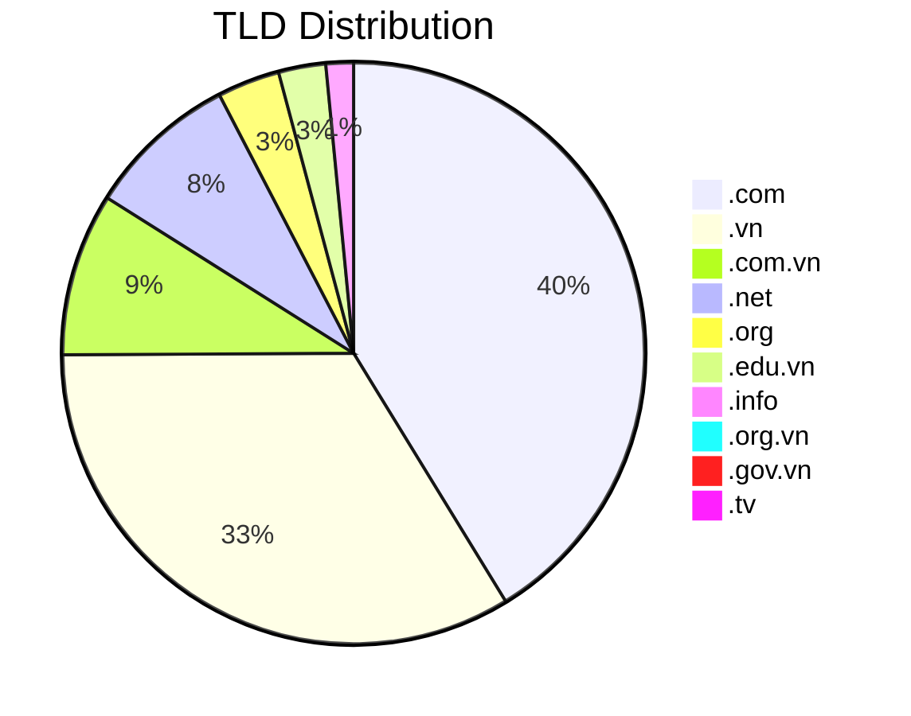
```mermaid
pie title TLD Distribution
    ".com" : 886131.0
    ".vn" : 723088.0
    ".com.vn" : 194296.0
    ".net" : 180767.0
    ".org" : 74475.0
    ".edu.vn" : 56296.0
    ".info" : 32896.0
    ".org.vn" : 21928.0
    ".gov.vn" : 21799.0
    ".tv" : 14851.0
```

### 21. Domain Diversity Over Time

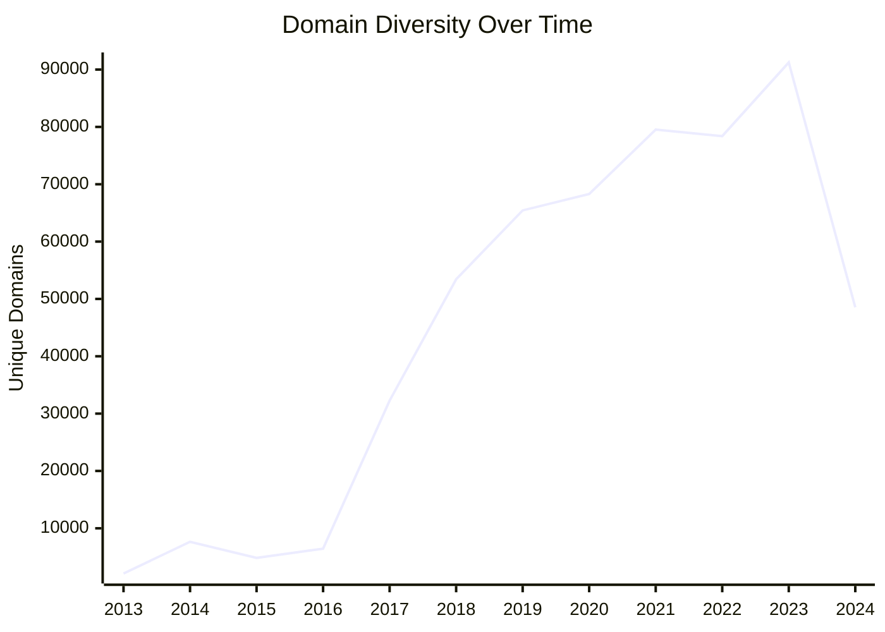
```mermaid
xychart-beta
    title "Domain Diversity Over Time"
    x-axis ["2013", "2014", "2015", "2016", "2017", "2018", "2019", "2020", "2021", "2022", "2023", "2024"]
    y-axis "Unique Domains"
    line [2109, 7649, 4846, 6452, 32271, 53417, 65435, 68294, 79528, 78390, 91236, 48546]
```

### 22. URL Path Depth

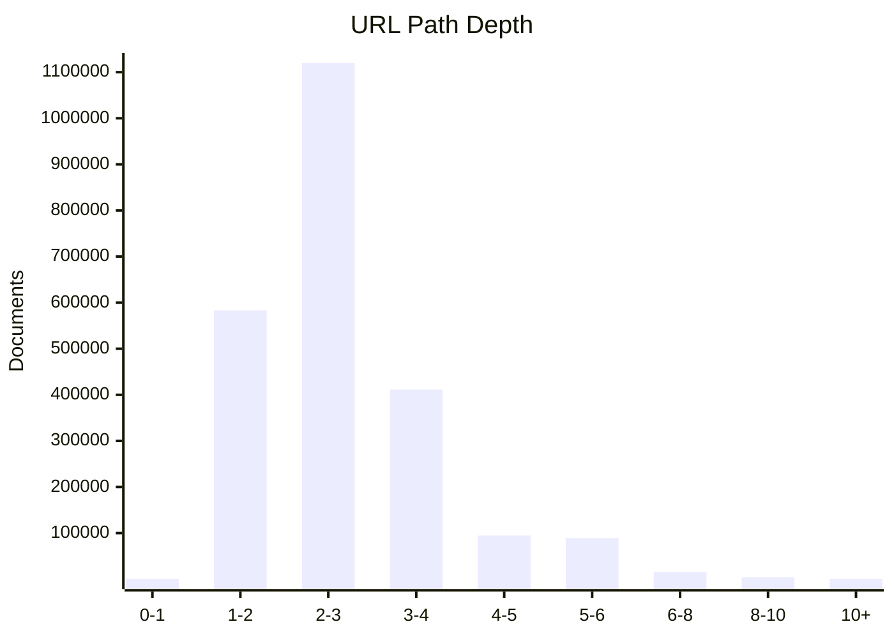
```mermaid
xychart-beta
    title "URL Path Depth"
    x-axis ["0-1", "1-2", "2-3", "3-4", "4-5", "5-6", "6-8", "8-10", "10+"]
    y-axis "Documents"
    bar [393, 583221, 1119773, 411399, 94642, 89013, 15675, 3887, 997]
```

### 23. Protocol Distribution

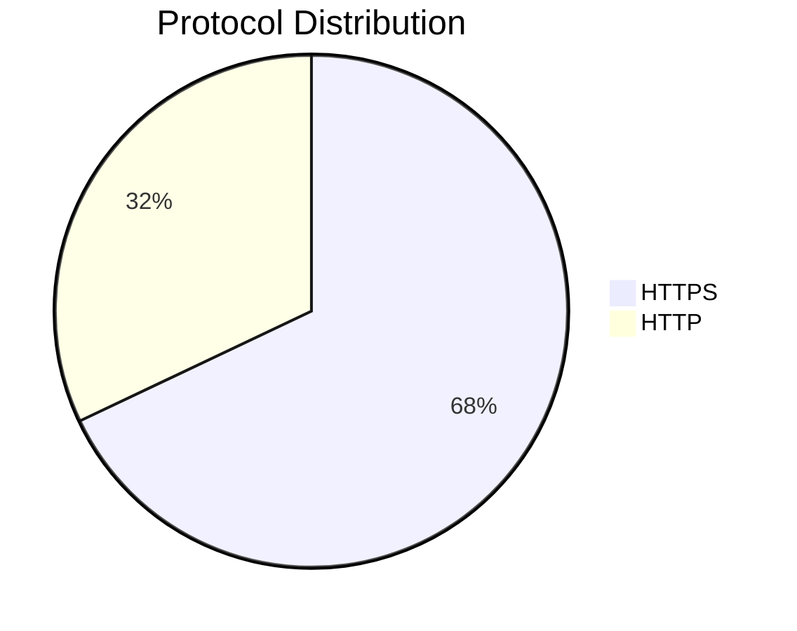
```mermaid
pie title Protocol Distribution
    "HTTPS" : 1575862.0
    "HTTP" : 743138.0
```

### 24. URL Length Distribution

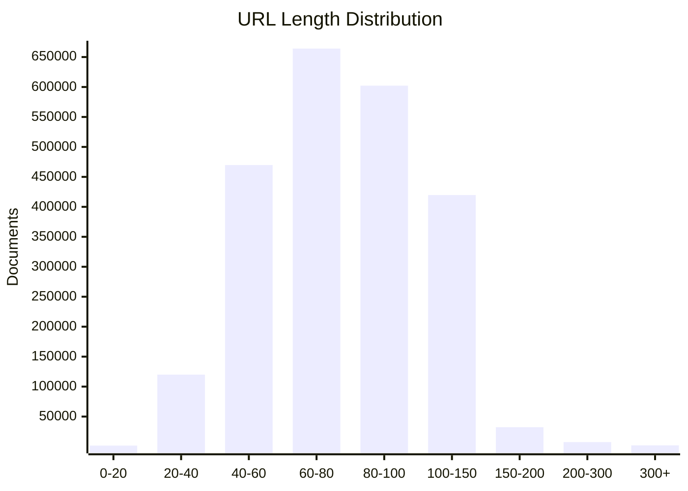
```mermaid
xychart-beta
    title "URL Length Distribution"
    x-axis ["0-20", "20-40", "40-60", "60-80", "80-100", "100-150", "150-200", "200-300", "300+"]
    y-axis "Documents"
    bar [1591, 119937, 469732, 664192, 602266, 419657, 32218, 7478, 1929]
```

### 25. Subdomain Analysis

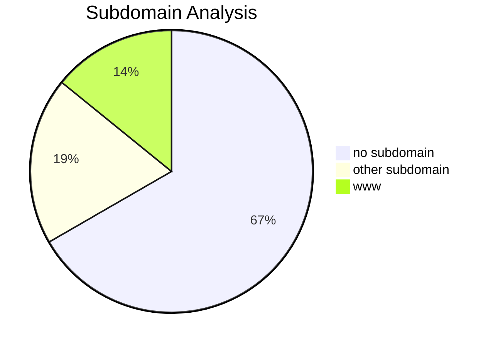
```mermaid
pie title Subdomain Analysis
    "no subdomain" : 1546094.0
    "other subdomain" : 444866.0
    "www" : 328040.0
```

### 26. Top 20 Vietnamese Domains (.vn)

**Top 20 Vietnamese Domains (.vn)**

```
nld.com.vn          ████████████████████████████████████████ 11.6K
truyenfull.vn       ███████████████████████████████████████ 11.2K
eva.vn              ██████████████████████████████████ 9.8K
plo.vn              █████████████████████████████████ 9.5K
vietbao.vn          ███████████████████████████████ 9.1K
vietnamnet.vn       ██████████████████████████ 7.6K
vtv.vn              ███████████████████████ 6.7K
baotintuc.vn        █████████████████████ 6.1K
kenh14.vn           ████████████████████ 5.7K
thanhnien.vn        ███████████████████ 5.6K
danviet.vn          ███████████████████ 5.6K
vtc.vn              ███████████████████ 5.5K
laodong.vn          ████████████████ 4.5K
vov.vn              ███████████████ 4.2K
saostar.vn          ██████████████ 4.1K
sggp.org.vn         █████████████ 3.9K
vietnamplus.vn      █████████████ 3.7K
thethao.sggp.org.vn █████████████ 3.7K
tienphong.vn        █████████████ 3.7K
viettimes.vn        ████████████ 3.6K
```

### 27. Domain Concentration

- Total unique domains: **277361**
- Top 10 domains cover: **4.4%** of all documents
- Top 100 domains cover: **14.1%** of all documents

### 28. Top Domains by Average Text Length

**Top Domains by Average Text Length**

```
sontrung.blogspot.com       ████████████████████████████████████████ 64.4K
minhtrietmoi.org            █████████████████████████████████████ 60.1K
viteuu.blogspot.com         ████████████████████████████████ 51.6K
joshuamehigan.net           ███████████████████████████████ 50.5K
sonako.fandom.com           █████████████████████████████ 46.4K
sonako.wikia.com            ████████████████████████████ 44.3K
tieuthuyettinhyeu.hexat.com ███████████████████████████ 43.2K
tangthuphathoc.net          █████████████████████████ 40.1K
vi.scribd.com               █████████████████████████ 40.0K
nghiencuulichsu.com         ████████████████████████ 39.4K
budsas.org                  ████████████████████████ 38.3K
luanvan.co                  ██████████████████████ 35.9K
chinhnghia.com              █████████████████████ 33.7K
truyendoi.com               ████████████████████ 31.9K
bacsixanh.vn                ███████████████████ 31.1K
thongluan-rdp.org           ███████████████████ 30.1K
slideshare.net              ███████████████████ 29.9K
gpphanthiet.com             █████████████████ 28.1K
phatan.org                  █████████████████ 27.6K
thingsthatdontexist.com     █████████████████ 26.8K
```

### 29. New Domains per Year

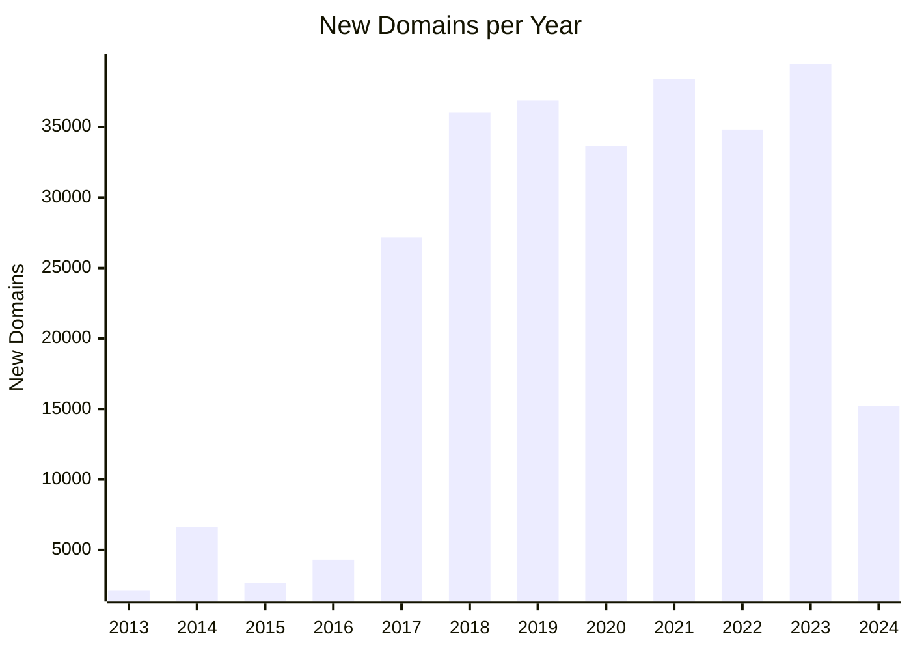
```mermaid
xychart-beta
    title "New Domains per Year"
    x-axis ["2013", "2014", "2015", "2016", "2017", "2018", "2019", "2020", "2021", "2022", "2023", "2024"]
    y-axis "New Domains"
    bar [2109, 6651, 2643, 4307, 27184, 36043, 36875, 33647, 38398, 34824, 39441, 15239]
```

### 30. Query Parameter Prevalence

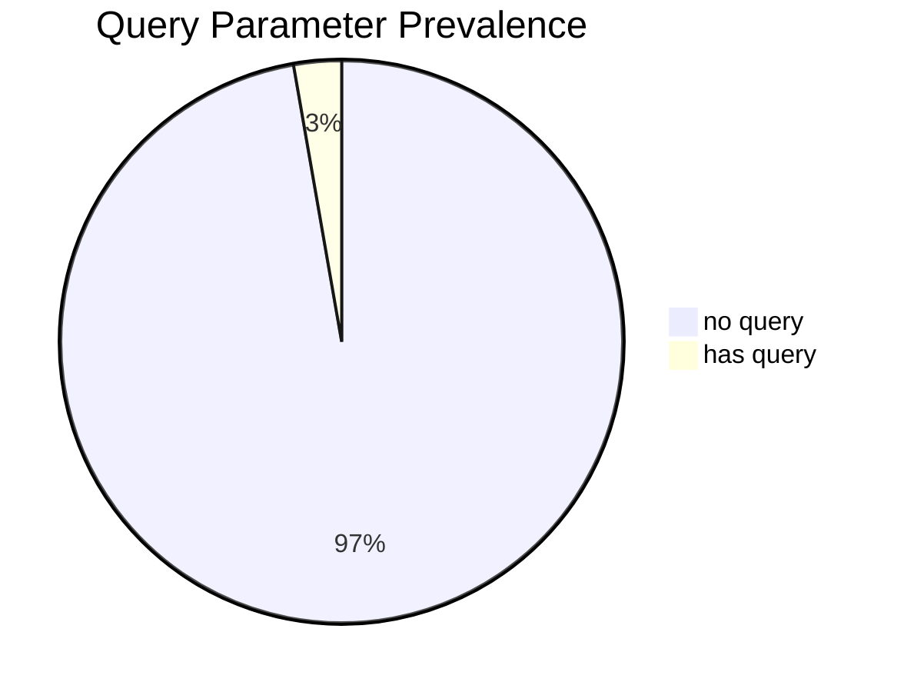
```mermaid
pie title Query Parameter Prevalence
    "no query" : 2255310.0
    "has query" : 63690.0
```


---

## Quality & Deduplication

### 31. Language Score Distribution

```mermaid
xychart-beta
    title "Language Score Distribution"
    x-axis ["0.8-0.9", "0.9-0.95", "0.95-0.99", "0.99-1", "1-1", "1+"]
    y-axis "Documents"
    bar [294, 344, 872, 1620, 14325, 2301545]
```

### 32. Language Score Percentiles

| Percentile | Value |
| --- | --- |
| P1 | 1 |
| P5 | 1 |
| P10 | 1 |
| P25 | 1 |
| P50 (Median) | 1 |
| P75 | 1 |
| P90 | 1 |
| P95 | 1 |
| P99 | 1 |
| Mean | 1 |
| Std Dev | 0.002 |
| Min | 0.8028079867362976 |
| Max | 1.0000100135803223 |

### 33. MinHash Cluster Size Distribution

```mermaid
xychart-beta
    title "MinHash Cluster Size Distribution"
    x-axis ["1-2", "2-5", "5-10", "10-20", "20-50", "50-100", "100-500", "500+"]
    y-axis "Documents"
    bar [271192, 581599, 605774, 524021, 268155, 45221, 18793, 4245]
```

### 34. Cluster Size Categories

```mermaid
pie title Cluster Size Categories
    "Medium (6-20)" : 998347.0
    "Small (2-5)" : 741154.0
    "Large (21-100)" : 285586.0
    "Unique (1)" : 271192.0
    "Very Large (100+)" : 22721.0
```

### 35. Language Score vs Text Length

| Score Band | Documents | Mean Text Len | Median Text Len |
| --- | --- | --- | --- |
| 0.9-0.95 | 0 | 4775 | 2490 |
| 0.95-0.99 | 0 | 4130 | 2310 |
| <0.9 | 0 | 3751 | 1833 |
| >=0.99 | 0 | 4175 | 3023 |

### 36. Score & Cluster Summary

| Metric | Language Score | Cluster Size |
| --- | --- | --- |
| Mean | 0.999968 | 20.9 |
| Std Dev | 0.001972 | 1436.1 |
| Median | 1.00001 | 7 |

### 37. Quality Score Bands

```mermaid
pie title Quality Score Bands
    "0.80-0.90" : 294.0
    "0.90-0.95" : 344.0
    "0.95-0.99" : 872.0
    "0.99-1.00" : 2317490.0
```

### 38. top_langs Field Completeness

```mermaid
pie title top_langs Field Completeness
    "empty" : 2319000.0
```

### 39. Avg Cluster Size by Top Dumps

**Avg Cluster Size by Top Dumps**

```
CC-MAIN-2023-40  0
CC-MAIN-2023-50  0
CC-MAIN-2022-49  0
CC-MAIN-2022-40  0
CC-MAIN-2023-06  0
CC-MAIN-2023-23  0
CC-MAIN-2023-14  0
CC-MAIN-2024-10  0
CC-MAIN-2022-21  0
CC-MAIN-2024-18  0
CC-MAIN-2022-27  0
CC-MAIN-2021-43  0
CC-MAIN-2021-31  0
CC-MAIN-2020-40  0
CC-MAIN-2022-05  0
CC-MAIN-2021-39  0
CC-MAIN-2021-17  0
CC-MAIN-2021-04  0
CC-MAIN-2022-33  0
CC-MAIN-2021-10  0
```


---

## Vietnamese Content Analysis

### 40. Vietnamese Tone Distribution

```mermaid
pie title Vietnamese Tone Distribution
    "sắc (rising)" : 1681043.0
    "huyền (falling)" : 1331542.0
    "nặng (heavy)" : 1306876.0
    "hỏi (questioning)" : 756172.0
    "ngã (tumbling)" : 345318.0
```

### 41. Vietnamese Diacritic Frequency

**Vietnamese Diacritic Frequency**

```
à  ████████████████████████████████████████ 561.9K
á  ███████████████████████████ 374.3K
ạ █████████████████ 239.5K
ế █████████████████ 236.9K
ệ ███████████████ 209.9K
ả ██████████████ 197.6K
ó  ██████████████ 196.8K
ộ █████████████ 179.4K
ấ ████████████ 173.1K
ớ ████████████ 166.6K
ố ███████████ 151.2K
ể ██████████ 142.7K
ờ ██████████ 140.2K
ợ ██████████ 138.2K
ề ██████████ 134.0K
ì  █████████ 128.1K
ủ █████████ 124.8K
ậ ████████ 107.3K
ị ████████ 106.8K
ầ ███████ 104.8K
í  ███████ 97.5K
ự ███████ 95.1K
ữ ██████ 86.4K
ụ ██████ 79.8K
ọ █████ 77.2K
ú  █████ 77.2K
ứ █████ 75.4K
ắ █████ 70.1K
ở █████ 68.1K
ã  █████ 67.4K
```

### 42. Vietnamese Vowel Frequency

**Vietnamese Vowel Frequency**

```
a  ████████████████████████████████████████ 2.3M
i  ██████████████████████████████████ 1.9M
u  ████████████████████ 1.1M
o  █████████████████ 993.3K
ê ████████████████ 935.9K
ư █████████████ 756.4K
ô ████████████ 680.5K
ơ ███████████ 645.2K
â ██████████ 585.4K
y  ████████ 433.9K
e  ██████ 346.6K
ă ████ 246.6K
```

### 43. Vietnamese Character Density

```mermaid
pie title Vietnamese Character Density
    "Vietnamese-heavy (>10%)" : 29895.0
    "Some Vietnamese (1-10%)" : 90.0
    "Minimal Vietnamese (<1%)" : 15.0
```

### 44. Vietnamese Stop Words

**Vietnamese Stop Words**

```
và      ████████████████████████████████████████ 54.6K
có      ████████████████████████████████████ 48.5K
của    ███████████████████████████████████ 48.2K
là      ███████████████████████████████████ 47.6K
các     ███████████████████████████ 36.8K
được ██████████████████████████ 35.2K
một    █████████████████████████ 33.5K
trong    ████████████████████████ 32.2K
cho      ███████████████████████ 30.8K
với    ██████████████████████ 30.1K
không   █████████████████████ 28.3K
những  ████████████████████ 28.0K
người ██████████████████ 24.5K
để    ███████████████ 20.6K
đã     ███████████████ 20.6K
khi      ████████████ 17.0K
nhiều  ████████████ 16.8K
đến   ████████████ 16.2K
sẽ     ████████████ 15.8K
như     ███████████ 14.6K
từ     ███████████ 14.4K
về     ███████████ 14.3K
tại    ██████████ 13.7K
này     ██████████ 13.2K
trên    █████████ 12.8K
ra       █████████ 12.7K
cũng    █████████ 12.5K
vào     █████████ 12.5K
bị     ████████ 11.0K
mà      ███████ 10.1K
```

### 45. Sentence-Ending Punctuation

```mermaid
pie title Sentence-Ending Punctuation
    "Period (.)" : 497712.0
    "Question (?)" : 23516.0
    "Exclamation (!)" : 11747.0
```

### 46. Numeric Content Density

```mermaid
pie title Numeric Content Density
    "<1%" : 32193.0
    "1-2%" : 12362.0
    "2-5%" : 5316.0
    "5-10%" : 126.0
    "10%+" : 3.0
```

### 47. Content Cleanliness

```mermaid
pie title Content Cleanliness
    "Clean text" : 2318434.0
    "Contains JS/Code" : 560.0
    "Contains HTML" : 6.0
```

### 48. Content Type Classification

```mermaid
pie title Content Type Classification
    "Other" : 1725574.0
    "News" : 319120.0
    "E-commerce" : 91303.0
    "Blog" : 69513.0
    "Forum" : 45261.0
    "Education" : 45143.0
    "Government" : 14365.0
    "Wiki/Reference" : 8721.0
```

### 49. Vietnamese Complexity by Dump

| Dump | Avg Diacritic Ratio | Documents |
| --- | --- | --- |
| CC-MAIN-2023-40 | 0.2073 | 1701 |
| CC-MAIN-2023-50 | 0.2059 | 1542 |
| CC-MAIN-2022-40 | 0.2067 | 1454 |
| CC-MAIN-2022-49 | 0.2061 | 1440 |
| CC-MAIN-2023-23 | 0.2066 | 1423 |
| CC-MAIN-2023-06 | 0.2058 | 1354 |
| CC-MAIN-2023-14 | 0.2064 | 1342 |
| CC-MAIN-2024-10 | 0.2083 | 1256 |
| CC-MAIN-2022-21 | 0.2052 | 1161 |
| CC-MAIN-2024-18 | 0.2089 | 1113 |
| CC-MAIN-2022-27 | 0.2064 | 1062 |
| CC-MAIN-2021-43 | 0.2057 | 1023 |
| CC-MAIN-2020-40 | 0.207 | 976 |
| CC-MAIN-2021-31 | 0.2061 | 963 |
| CC-MAIN-2021-17 | 0.2059 | 922 |
| CC-MAIN-2021-39 | 0.2051 | 909 |
| CC-MAIN-2021-04 | 0.206 | 908 |
| CC-MAIN-2022-05 | 0.2061 | 900 |
| CC-MAIN-2022-33 | 0.2063 | 832 |
| CC-MAIN-2021-10 | 0.2059 | 765 |

---

*Report generated in 5m39.475s using DuckDB analytics*
