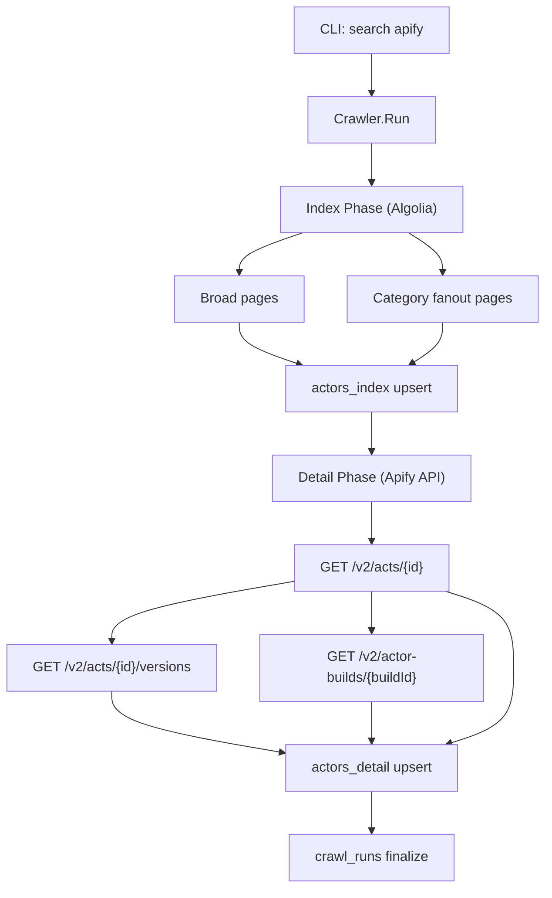

# 0692 - Apify Store Actor Deep Ingestion to DuckDB

## 1. Objective
Build `pkg/dcrawler/apify` and CLI support to ingest the Apify Store actor catalog with maximum practical detail, then persist it into:

- `$HOME/data/apify/apify.duckdb`

Primary target universe on **2026-03-08**:

- `18,827` store actors

This spec covers research, architecture, DuckDB schema, crawl workflow, error handling, and verification.

## 2. Source Research (2026-03-08)

### 2.1 Store discovery source
- Store page: `https://apify.com/store/categories`
- The web app uses Algolia for listing/search.

### 2.2 Algolia backend used by store frontend
- App ID: `OW0O5I3QO7`
- Public search key: `0ecccd09f50396a4dbbe5dbfb17f4525`
- Index: `prod_PUBLIC_STORE`
- Endpoint:
  - `POST https://OW0O5I3QO7-dsn.algolia.net/1/indexes/prod_PUBLIC_STORE/query`

Observed with empty query on 2026-03-08:
- `nbHits = 18827`

### 2.3 Actor detail and enrichment endpoints
Public endpoints used:
- `GET https://api.apify.com/v2/acts/{objectID}`
- `GET https://api.apify.com/v2/acts/{objectID}/versions?limit=1000&offset=...&desc=true`
- `GET https://api.apify.com/v2/actor-builds/{buildId}`

Notes:
- `buildId` comes from `taggedBuilds.latest.buildId` in `/v2/acts/{objectID}`.
- `actor-builds/{buildId}` returns deep metadata (input schema, readme/changelog, env vars, storages, runtime options/stats, etc.).
- Some endpoints require token and are intentionally not used in anonymous crawling (e.g. actor builds listing under `/acts/{id}/builds` returns `401`).

## 3. Coverage Strategy

### 3.1 Why not only broad pagination
Broad query pagination can be limited by Algolia `paginationLimitedTo` behavior. To maximize coverage:

1. Crawl broad pages.
2. Crawl per-category pages from Algolia facets (`categories`) and union by PK (`object_id`) in DB.

This bypasses broad-query truncation and reaches full observed universe (`18827`).

### 3.2 Detail depth policy
For each actor:
1. Fetch base actor detail.
2. Enrich with full versions list.
3. Enrich with latest build payload.
4. Persist normalized columns + raw JSON snapshots.
5. Persist non-fatal enrichment errors in `enrichment_error` while still saving successful base detail.

## 4. Architecture



### 4.1 Components
- `pkg/dcrawler/apify/config.go`: crawl configuration and defaults.
- `pkg/dcrawler/apify/client.go`: Algolia + Apify HTTP client.
- `pkg/dcrawler/apify/crawler.go`: orchestration, workers, retries, enrichment.
- `pkg/dcrawler/apify/db.go`: DuckDB schema, migrations, upserts, counters.
- `cli/apify.go`: `search apify` command and `info` subcommand.

### 4.2 Concurrency model
- Worker pool for index and detail stages.
- Optional detail-side QPS limiter.
- Retry with backoff for transient failures.
- DuckDB operations serialized via mutex to avoid concurrent write issues.

## 5. DuckDB Schema

## 5.1 Table: `crawl_runs`
```sql
CREATE TABLE IF NOT EXISTS crawl_runs (
  run_id              VARCHAR PRIMARY KEY,
  started_at          TIMESTAMP,
  finished_at         TIMESTAMP,
  store_url           VARCHAR,
  expected_total      BIGINT,
  index_pages         BIGINT,
  indexed_total       BIGINT,
  detail_queued       BIGINT,
  detail_done         BIGINT,
  detail_success      BIGINT,
  detail_failed       BIGINT,
  status              VARCHAR,
  notes               VARCHAR
);
```

## 5.2 Table: `actors_index`
```sql
CREATE TABLE IF NOT EXISTS actors_index (
  object_id           VARCHAR PRIMARY KEY,
  username            VARCHAR,
  name                VARCHAR,
  title               VARCHAR,
  description         VARCHAR,
  categories_json     VARCHAR,
  modified_at_epoch   BIGINT,
  created_at_epoch    BIGINT,
  picture_url         VARCHAR,
  raw_json            VARCHAR,
  indexed_at          TIMESTAMP
);
```

## 5.3 Table: `actors_detail`
```sql
CREATE TABLE IF NOT EXISTS actors_detail (
  object_id                  VARCHAR PRIMARY KEY,
  username                   VARCHAR,
  name                       VARCHAR,
  title                      VARCHAR,
  description                VARCHAR,
  notice                     VARCHAR,
  readme_summary             VARCHAR,
  actor_permission_level     VARCHAR,
  deployment_key             VARCHAR,
  standby_url                VARCHAR,
  picture_url                VARCHAR,
  seo_title                  VARCHAR,
  seo_description            VARCHAR,
  is_public                  BOOLEAN,
  is_deprecated              BOOLEAN,
  is_generic                 BOOLEAN,
  is_critical                BOOLEAN,
  is_source_code_hidden      BOOLEAN,
  has_no_dataset             BOOLEAN,
  created_at                 TIMESTAMP,
  modified_at                TIMESTAMP,
  categories_json            VARCHAR,
  stats_json                 VARCHAR,
  pricing_infos_json         VARCHAR,
  versions_json              VARCHAR,
  versions_all_json          VARCHAR,
  default_run_options_json   VARCHAR,
  example_run_input_json     VARCHAR,
  tagged_builds_json         VARCHAR,
  input_schema_json          VARCHAR,
  output_schema_json         VARCHAR,
  readme                     VARCHAR,
  readme_markdown            VARCHAR,
  latest_build_id            VARCHAR,
  latest_build_status        VARCHAR,
  latest_build_started_at    TIMESTAMP,
  latest_build_finished_at   TIMESTAMP,
  latest_build_stats_json    VARCHAR,
  latest_build_options_json  VARCHAR,
  latest_build_meta_json     VARCHAR,
  latest_build_env_json      VARCHAR,
  latest_build_storages_json VARCHAR,
  latest_build_input_schema  VARCHAR,
  latest_build_readme        VARCHAR,
  latest_build_changelog     VARCHAR,
  latest_build_dockerfile    VARCHAR,
  latest_build_raw_json      VARCHAR,
  enrichment_error           VARCHAR,
  status_code                INTEGER,
  error                      VARCHAR,
  raw_json                   VARCHAR,
  fetched_at                 TIMESTAMP
);
```

### 5.4 Schema migration policy
`OpenDB()` runs `ALTER TABLE ... ADD COLUMN IF NOT EXISTS` for newly introduced deep columns to keep old DB files compatible.

## 6. Data Collected per Actor

## 6.1 Base actor detail (`/v2/acts/{id}`)
- Identity/profile: id, userId, username, name, title, description, notice
- Visibility/flags: isPublic, isDeprecated, isGeneric, isCritical, isSourceCodeHidden
- Operational markers: deploymentKey, standbyUrl, hasNoDataset
- SEO/visual: seoTitle, seoDescription, pictureUrl
- Timing: createdAt, modifiedAt
- Rich JSON blocks: stats, pricingInfos, defaultRunOptions, exampleRunInput, taggedBuilds, readme, readmeMarkdown, inputSchema, outputSchema

## 6.2 Versions enrichment (`/versions`)
- Paged fetch to gather full version list.
- Stored in:
  - `versions_json` (compatibility slot)
  - `versions_all_json` (full list)

## 6.3 Latest build enrichment (`/actor-builds/{buildId}`)
Deep fields stored in dedicated columns:
- Build identity/status/timing: `latest_build_id`, `latest_build_status`, `latest_build_started_at`, `latest_build_finished_at`
- Build JSON blocks: stats/options/meta/env/storages
- Long text assets: input schema/readme/changelog/dockerfile
- Raw snapshot: `latest_build_raw_json`

## 7. Reliability and Error Semantics

- Retry count controlled by `--retries`.
- Backoff via increasing sleep per attempt.
- Detail API errors recorded as rows with `status_code`, `error`, `raw_json`.
- Enrichment failures do not discard base detail; they are aggregated into `enrichment_error`.
- Resume behavior:
  - default: fetch only missing/failed detail rows
  - `--refresh-details`: force re-fetch even if success exists

## 8. CLI Contract

### 8.1 Main command
- `search apify`

### 8.2 Subcommand
- `search apify info`

### 8.3 Important flags
- `--workers` concurrent workers
- `--qps` detail request rate limit (`0` = unlimited)
- `--timeout` request timeout (seconds)
- `--retries` max retries
- `--hits-per-page` Algolia page size (`<= 1000`)
- `--max-details` cap detail fetch count (`0` = all pending)
- `--data-dir` output directory override
- `--db` DB path override
- `--refresh-details` force re-fetch details
- `--index-only` skip detail phase
- `--detail-only` skip index phase
- `--enrich-versions` enable versions enrichment (default `true`)
- `--enrich-build` enable latest-build enrichment (default `true`)

## 9. Verification

### 9.1 Compile checks
```bash
go test ./pkg/dcrawler/apify -run TestNonExistent -count=1
go test ./cli -run TestNonExistent -count=1
go test ./cmd/search -run TestNonExistent -count=1
```

### 9.2 Index coverage check
```bash
go run ./cmd/search apify --db "$HOME/data/apify/apify.duckdb" --index-only --workers 8
go run ./cmd/search apify info --db "$HOME/data/apify/apify.duckdb"
```
Expect indexed actors to match observed universe (`18827` on 2026-03-08).

### 9.3 Deep-detail smoke check
```bash
go run ./cmd/search apify --db "$HOME/data/apify/apify.duckdb" --detail-only --refresh-details --max-details 20 --workers 8 --qps 20
```

### 9.4 SQL validation examples
```sql
-- headline counts
SELECT
  (SELECT COUNT(*) FROM actors_index) AS indexed,
  (SELECT COUNT(*) FROM actors_detail WHERE status_code BETWEEN 200 AND 299) AS detail_success,
  (SELECT COUNT(*) FROM actors_detail WHERE status_code < 200 OR status_code >= 300) AS detail_failed;

-- deep enrichment presence
SELECT
  COUNT(*) AS total_success,
  COUNT(*) FILTER (WHERE versions_all_json IS NOT NULL AND length(versions_all_json) > 2) AS with_versions_all,
  COUNT(*) FILTER (WHERE latest_build_id IS NOT NULL) AS with_latest_build,
  COUNT(*) FILTER (WHERE latest_build_input_schema IS NOT NULL AND length(latest_build_input_schema) > 0) AS with_build_input_schema
FROM actors_detail
WHERE status_code BETWEEN 200 AND 299;

-- inspect top rich rows
SELECT object_id, latest_build_id, length(latest_build_input_schema) AS schema_len, length(latest_build_readme) AS readme_len
FROM actors_detail
WHERE status_code BETWEEN 200 AND 299
ORDER BY fetched_at DESC
LIMIT 20;
```

## 10. Operational Runbook

1. Initial full index:
```bash
go run ./cmd/search apify --db "$HOME/data/apify/apify.duckdb" --index-only --workers 16
```

2. Full deep detail crawl:
```bash
go run ./cmd/search apify --db "$HOME/data/apify/apify.duckdb" --detail-only --workers 16 --qps 25
```

3. Periodic refresh for completeness:
```bash
go run ./cmd/search apify --db "$HOME/data/apify/apify.duckdb" --detail-only --refresh-details --workers 16 --qps 25
```

4. Monitor:
```bash
go run ./cmd/search apify info --db "$HOME/data/apify/apify.duckdb"
```

## 11. Limits and Future Work

- Anonymous mode cannot access token-protected endpoints (runs, some build listings, private assets).
- Enrichment quality depends on actor metadata availability (not all actors expose identical depth).
- Possible future additions:
  - auth-enabled mode using `APIFY_TOKEN` for private/richer endpoints
  - separate history tables for version/build snapshots over time
  - normalized JSON extraction views for analytics workloads
