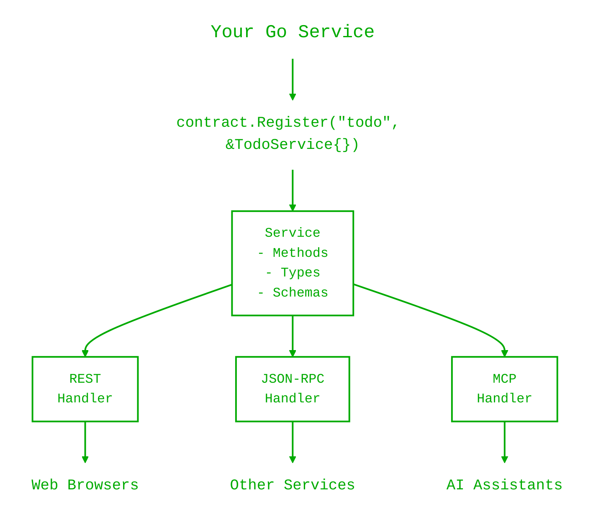

# Contract Overview

Contract is a Go package that lets you write your business logic once and automatically expose it through multiple API protocols (REST, JSON-RPC, MCP, tRPC) without duplicating code.

## What Problem Does Contract Solve?

Imagine you're building a todo list application. You want to:
- Let web browsers call your API via REST
- Let other services call via JSON-RPC for batching
- Let AI assistants (like Claude) use your API via MCP
- Generate TypeScript types for your frontend

Without Contract, you'd write code like this for **each protocol**:

```go
// REST handler - one version
func handleRESTCreateTodo(w http.ResponseWriter, r *http.Request) {
    var input CreateInput
    json.NewDecoder(r.Body).Decode(&input)
    todo, err := createTodo(input)
    if err != nil {
        http.Error(w, err.Error(), 500)
        return
    }
    json.NewEncoder(w).Encode(todo)
}

// JSON-RPC handler - another version
func handleJSONRPCCreateTodo(req JSONRPCRequest) JSONRPCResponse {
    var input CreateInput
    json.Unmarshal(req.Params, &input)
    todo, err := createTodo(input)
    if err != nil {
        return JSONRPCResponse{Error: ...}
    }
    return JSONRPCResponse{Result: todo}
}

// MCP handler - yet another version...
```

That's a lot of repetitive code! And if you add a new field to `CreateInput`, you need to update every handler.

With Contract, you write your business logic **once**:

```go
// Your business logic - plain Go, no HTTP dependencies
func (s *TodoService) Create(ctx context.Context, in *CreateInput) (*Todo, error) {
    return &Todo{ID: generateID(), Title: in.Title}, nil
}
```

Then Contract automatically makes it available via all protocols:

```go
svc, _ := contract.Register("todo", &TodoService{})

mux := http.NewServeMux()
contract.MountREST(mux, svc)           // REST: POST /todos
contract.MountJSONRPC(mux, "/rpc", svc) // JSON-RPC: method "Create"
mcp.Mount(mux, "/mcp", svc)             // MCP: tool "todo.Create"
trpc.Mount(mux, "/trpc", svc)           // tRPC: POST /trpc/Create
```

## What Is a "Contract"?

Think of a contract like a restaurant menu. The menu tells you:
- What dishes are available (methods)
- What each dish contains (input/output types)
- What you'll get when you order (response format)

In programming terms, a **contract** is a formal definition of:
- **What operations your service offers** (methods like Create, List, Get, Delete)
- **What data each operation expects** (input types)
- **What data each operation returns** (output types)
- **What errors can occur** (error types)

When you register a Go struct with Contract, it inspects your methods and creates this formal definition automatically. This definition is then used to:
1. Generate API endpoints for different protocols
2. Create JSON schemas for validation
3. Generate client code for different languages
4. Provide API documentation

## How Contract Works (The Big Picture)

Here's what happens when you use Contract:



```
                    Your Go Service
                          │
                          ▼
              contract.Register("todo", &TodoService{})
                          │
                          │  Inspects methods, generates schemas
                          ▼
                   ┌─────────────┐
                   │   Service   │
                   │  - Methods  │
                   │  - Types    │
                   │  - Schemas  │
                   └─────────────┘
                          │
         ┌────────────────┼────────────────┐
         ▼                ▼                ▼
    ┌─────────┐     ┌──────────┐     ┌─────────┐
    │  REST   │     │ JSON-RPC │     │   MCP   │
    │ Handler │     │ Handler  │     │ Handler │
    └─────────┘     └──────────┘     └─────────┘
         │                │                │
         ▼                ▼                ▼
    Web Browsers    Other Services    AI Assistants
```

1. **You write** a plain Go struct with methods
2. **Contract inspects** your struct at startup (using reflection)
3. **Contract creates** type-safe "invokers" and JSON schemas
4. **Transport handlers** convert protocol-specific requests into method calls
5. **Your method runs** and returns results or errors
6. **Transport handlers** convert the response back to the protocol format

## Key Concepts

### Service

A **service** is a Go struct with methods that implement your business logic. Your methods should:
- Accept a `context.Context` as the first parameter
- Optionally accept an input struct pointer
- Return an output struct pointer and/or an error

```go
type TodoService struct {
    db Database  // Your dependencies
}

func (s *TodoService) Create(ctx context.Context, in *CreateInput) (*Todo, error) {
    // Your business logic here
}
```

### Method

A **method** is one operation your service can perform. Contract discovers methods automatically by inspecting your struct. Each method becomes:
- A REST endpoint (POST/GET/PUT/DELETE based on name)
- A JSON-RPC method
- An MCP tool
- A tRPC procedure

### Transport

A **transport** is a protocol handler that converts HTTP requests into method calls. Contract provides:

| Transport | Protocol | Best For |
|-----------|----------|----------|
| REST | HTTP REST | Web browsers, curl, general HTTP |
| JSON-RPC | JSON-RPC 2.0 | Batch operations, RPC clients |
| MCP | Model Context Protocol | AI assistants (Claude, etc.) |
| tRPC | tRPC-like | TypeScript frontends |
| OpenAPI | OpenAPI 3.1 | API documentation |

### Type Registry

Contract automatically creates JSON schemas from your Go types. These schemas are used for:
- Input validation
- API documentation (OpenAPI)
- Client code generation
- AI tool definitions (MCP)

## What You'll Learn

This documentation will teach you:

1. **[Quick Start](/contract/quick-start)** - Build your first API in 5 minutes
2. **[Defining Services](/contract/service)** - How to write service structs and methods
3. **[Registration](/contract/register)** - How Contract processes your service
4. **[Type System](/contract/types)** - Understanding types and JSON schemas
5. **[Error Handling](/contract/errors)** - How to return errors that work across protocols
6. **[Transports](/contract/transports-overview)** - Choosing and using different protocols
7. **[Testing](/contract/testing)** - How to test your services
8. **[Architecture](/contract/architecture)** - Deep dive into how it all works

## Quick Example

Here's a complete, working example you can run:

```go
package main

import (
    "context"
    "fmt"
    "net/http"

    "github.com/go-mizu/mizu/contract"
)

// Step 1: Define your service struct
type GreetingService struct{}

// Step 2: Define input/output types
type GreetInput struct {
    Name string `json:"name"`
}

type GreetOutput struct {
    Message string `json:"message"`
}

// Step 3: Implement your business logic
func (s *GreetingService) Greet(ctx context.Context, in *GreetInput) (*GreetOutput, error) {
    return &GreetOutput{
        Message: fmt.Sprintf("Hello, %s!", in.Name),
    }, nil
}

func main() {
    // Step 4: Register your service
    svc, err := contract.Register("greeting", &GreetingService{})
    if err != nil {
        panic(err)
    }

    // Step 5: Mount transports
    mux := http.NewServeMux()
    contract.MountREST(mux, svc)
    contract.MountJSONRPC(mux, "/rpc", svc)

    // Step 6: Start the server
    fmt.Println("Server running on http://localhost:8080")
    http.ListenAndServe(":8080", mux)
}
```

Test it:

```bash
# REST
curl -X POST http://localhost:8080/greetings \
  -H "Content-Type: application/json" \
  -d '{"name": "World"}'
# Output: {"message":"Hello, World!"}

# JSON-RPC
curl -X POST http://localhost:8080/rpc \
  -H "Content-Type: application/json" \
  -d '{"jsonrpc":"2.0","id":1,"method":"Greet","params":{"name":"World"}}'
# Output: {"jsonrpc":"2.0","id":1,"result":{"message":"Hello, World!"}}
```

## Common Questions

### Do I need to learn all the transports?

No! Start with REST - it's the most familiar. You can add other transports later as needed. Your business logic stays exactly the same.

### Is Contract only for new projects?

Contract works great for new projects, but you can also gradually adopt it in existing codebases. Start by converting one service and see how it fits.

### How does Contract handle authentication?

Contract doesn't dictate how you handle auth. You can use standard Go HTTP middleware to authenticate requests before they reach your methods. Context values let you pass user information to your service methods.

### Does Contract support gRPC?

Not yet, but the error codes are aligned with gRPC for future compatibility. The JSON-RPC transport works well for service-to-service communication.

## Next Steps

Ready to build your first API? Start with the **[Quick Start Guide](/contract/quick-start)** - you'll have a working API in 5 minutes.

If you prefer understanding the concepts first, read about **[Defining Services](/contract/service)** to learn how to structure your business logic.
